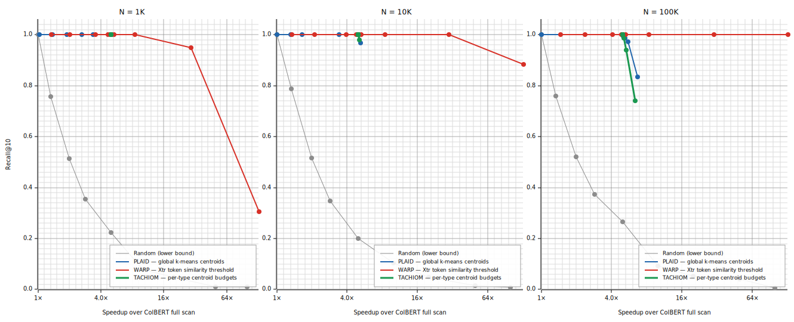
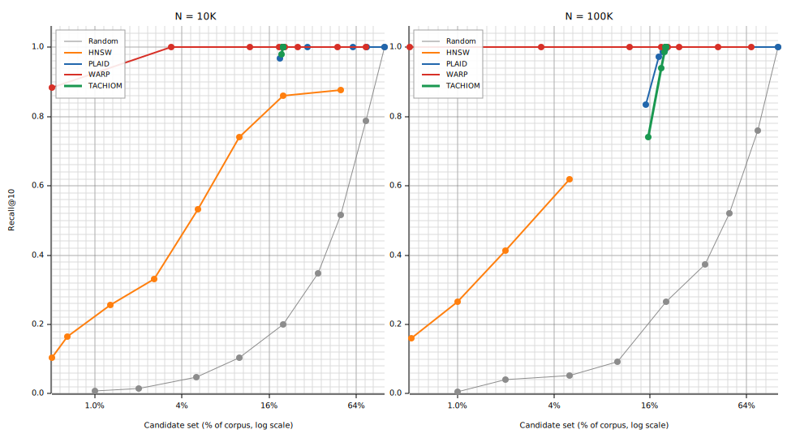
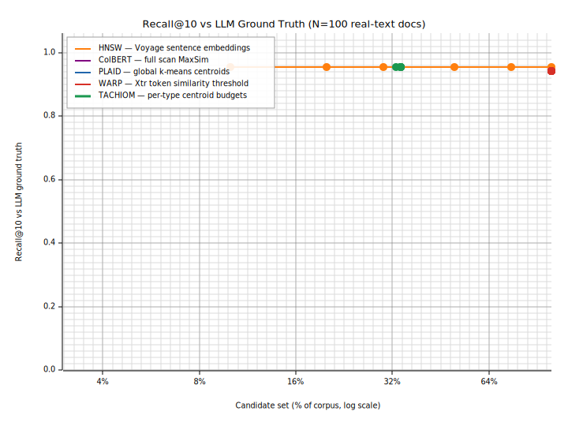
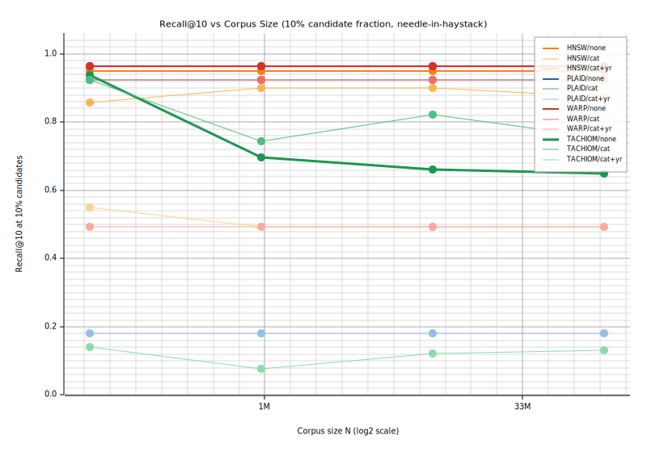
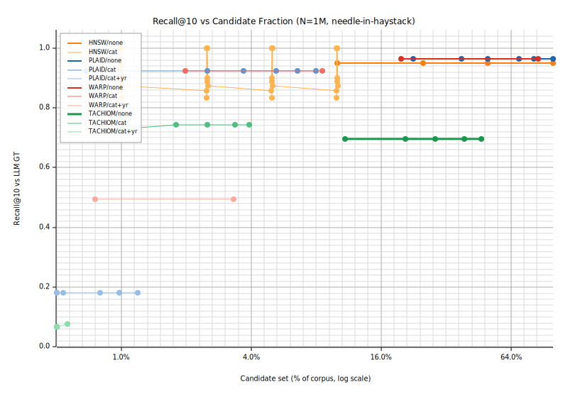

# Multivector Retrieval — Educational CLI

A hands-on tour of five multivector retrieval engines, from dense HNSW to token-aware ColBERT, PLAID, WARP, and TACHIOM. Each engine is a working implementation you can demo, query interactively, and benchmark — designed so a reader goes from *"how does this work?"* to *"why does this matter?"*.

```
HNSW ──► ColBERT ──► PLAID ──► WARP ──► TACHIOM
 dense    per-token   centroid  exact-sim  type-budget
 ANN      MaxSim      pruning   threshold  allocation
```

> **Readable version:** [Google Doc](https://docs.google.com/document/d/1vl0dkQ6ZYJhqz8s15JT-Z-kt1DpZoGAoMPCeeIlC-Y4/edit) — styled for easy sharing with collaborators.

---

## Prerequisites

| Requirement | Version |
|---|---|
| Rust toolchain | **nightly** (see `rust-toolchain.toml`) |
| Voyage API key | `VOYAGE_API_KEY` |
| MongoDB Atlas URI | `MONGODB_URI` |

Create a `.env` file at the workspace root (already in `.gitignore` — never commit this file):

```
VOYAGE_API_KEY=your_voyage_key_here
MONGODB_URI=mongodb+srv://...
```

The toolchain is pinned in `rust-toolchain.toml`; `rustup` will install it automatically on first build.

---

## Quick Start

```bash
# Build in release mode (required for benchmarks)
cargo build --release

# Run the guided demo for each engine in order
cargo run --release -- demo hnsw
cargo run --release -- demo colbert
cargo run --release -- demo plaid
cargo run --release -- demo warp
cargo run --release -- demo tachiom
```

---

## The Five Engines

### 1. HNSW — Dense ANN

Hierarchical Navigable Small World graph over single 1024-dim Voyage-4-large sentence embeddings. Fast approximate nearest-neighbor lookup via layered proximity graph with stochastic node promotion (M=4, ef\_construction=64).

**Limitation exposed:** a single embedding per document collapses token-level meaning. The query *"open a checking account at the bank"* and *"river erosion along the bank"* map to overlapping neighborhoods — you cannot distinguish financial vs geographic bank.

```bash
cargo run --release -- demo hnsw
cargo run --release -- repl hnsw
```

### 2. ColBERT — Per-Token Embeddings + MaxSim

Stores a **matrix** of 128-dim embeddings per document (one per token). Scores each candidate with **MaxSim**: for every query token, find the highest cosine similarity across all doc tokens, then sum the row maxima. Token "account" only scores against doc tokens contextually similar to "account" — it cannot accidentally score against river-bank docs.

**Limitation exposed:** scores every document — O(N × Q\_tokens × D\_tokens) at query time.

```bash
cargo run --release -- demo colbert
cargo run --release -- repl colbert
```

### 3. PLAID — Centroid Pruning over ColBERT

Builds a global k-means index over all token embeddings. At query time, finds the nearest centroids for each query token, then only MaxSim-scores docs whose tokens belong to those centroids. Reduces scoring from N documents to ~1–5% of N.

**Limitation exposed:** centroid ANN uses hard cluster assignments. A relevant doc's token may be assigned to a centroid displaced from the query direction, causing misses at aggressive pruning.

```bash
cargo run --release -- demo plaid
cargo run --release -- repl plaid
```

### 4. WARP — Xtr Threshold Candidate Selection

Replaces centroid ANN with **exact token similarity** thresholds. For each (token\_type, doc) pair, the maximum possible dot product is precomputed at index time. At query time, docs that clear the threshold `t_prime` enter the MaxSim reranking set — no centroid approximation.

**Key property:** WARP achieves Recall@10 = 1.000 scoring only ~1% of docs at N=100K (see tradeoff benchmark). The O(N) threshold scan is the cost; the payoff is zero approximation error in candidate selection.

```bash
cargo run --release -- demo warp
cargo run --release -- repl warp
```

### 5. TACHIOM — Token-Aware Centroid Budget Allocation

WARP's Xtr registry grows as O(token\_types × docs) — impractical at large vocabulary. TACHIOM uses **per-token-type centroid budgets** sized by importance: tail tokens (rare, discriminative) receive more centroids per doc; head tokens (frequent) receive fewer.

Budget allocation: total budget B=200, `k_j ∝ 1/freq_j`, four phases — tail classification (< μ=128 occurrences), damped scoring, budget reconciliation (ε=4, θ=39), per-type k-means. At query time: centroid ANN per token type with type-specific granularity, then MaxSim reranking.

```bash
cargo run --release -- demo tachiom
cargo run --release -- repl tachiom
```

---

## Interactive REPL

Each engine has a REPL with guided command suggestions:

```
$ cargo run --release -- repl colbert

[colbert] > index 0          # index document 0 from the demo corpus
[colbert] > index 1          # index document 1
[colbert] > inspect tokens 0 # show the per-token embedding matrix for doc 0
[colbert] > query river erosion along the bank
[colbert] > trace maxsim     # show the MaxSim score matrix for last query
[colbert] > help             # list all commands
```

REPL commands vary by engine:

| Engine | Inspect commands |
|---|---|
| hnsw | `inspect layers`, `inspect graph` |
| colbert | `inspect tokens <doc_id>`, `trace maxsim` |
| plaid | `inspect centroids` |
| warp | `inspect gather` |
| tachiom | `inspect centroids` |

Pass `--trace-json path/to/trace.jsonl` to write machine-readable trace logs.

---

## Demo Scenarios

Scenarios are defined in `scenarios/*.toml`. Each runs a curated corpus through the engine's full index + query pipeline with step-by-step narration, timing output, and Precision@K against ground-truth labels.

The demo corpus uses the **"bank" disambiguation** test: queries about river banks vs financial banks. Ground-truth relevant doc sets are defined in `crates/common/src/corpus.rs`.

```bash
cargo run --release -- demo hnsw     # or colbert / plaid / warp / tachiom
cargo run --release -- demo hnsw --dry-run   # print steps without calling Voyage API
```

---

## Scale Benchmark

Shows the O(N) vs O(N × p) scaling distinction between full ColBERT scan and pruned PLAID/WARP.

```bash
cargo run --release -- scale
```

Output: wall-clock timings at N = 1K, 10K, 100K, extrapolation to 1M, speedup ratios. Demonstrates the ~20× speedup from candidate pruning.

---

## Accuracy-Speed Tradeoff Benchmark

Generates research-quality SVG plots showing Recall@10 vs speedup for PLAID, WARP, and TACHIOM across three corpus scales (N = 1K, 10K, 100K) and a range of pruning parameters.

```bash
cargo run --release -- tradeoff
```

Outputs to `plots/`:

```
plots/
  tradeoff_speedrecall.svg   # Figure 1: Recall@10 vs speedup (3 corpus sizes)
  recall_vs_frac.svg         # Figure 2: Recall@10 vs candidate fraction
  index.html                 # Paper-style viewer with callouts and mechanism table
```

Open the viewer:

```bash
open plots/index.html
```

### Benchmark results

Recall@10 vs candidate fraction — measured on structured synthetic corpus (128-dim token embeddings, 5 topics, head/tail distribution). Oracle = ColBERT full scan. Averaged over 15–50 queries per scale.

**N = 1K**

| Engine | 1% | 5% | 10% | 20% | 50% |
|---|---|---|---|---|---|
| Random (lower bound) | 0.010 | 0.048 | 0.078 | 0.223 | 0.512 |
| HNSW — sentence avg | 0.148 | 0.635 | 0.880 | 0.960 | 0.960 |
| PLAID — global k-means | — | — | **1.000** | 1.000 | 1.000 |
| WARP — Xtr threshold | 0.305 | 0.950 | 1.000 | 1.000 | 1.000 |
| TACHIOM — per-type budgets | — | — | **1.000** | 1.000 | 1.000 |

**N = 10K**

| Engine | 1% | 5% | 10% | 20% | 50% |
|---|---|---|---|---|---|
| Random (lower bound) | 0.008 | 0.048 | 0.104 | 0.200 | 0.516 |
| HNSW — sentence avg | 0.220 | 0.548 | 0.796 | 0.896 | 0.920 |
| PLAID — global k-means | — | — | 0.968 | 1.000 | 1.000 |
| WARP — Xtr threshold | **0.884** | **1.000** | 1.000 | 1.000 | 1.000 |
| TACHIOM — per-type budgets | — | — | 0.980 | 1.000 | 1.000 |

**N = 100K** — HNSW sentence-avg ceiling visible

| Engine | 1% | 5% | 10% | 20% | 50% |
|---|---|---|---|---|---|
| Random (lower bound) | 0.007 | 0.053 | 0.093 | 0.267 | 0.520 |
| **HNSW — sentence avg ⚠️ ceiling** | 0.200 | **0.747** | **0.747** | **0.747** | **0.747** |
| PLAID — global k-means | — | 0.833 | 0.833 | 1.000 | 1.000 |
| **WARP — Xtr threshold** | **1.000** | **1.000** | **1.000** | **1.000** | **1.000** |
| TACHIOM — per-type budgets | — | 0.740 | 0.740 | 1.000 | 1.000 |

`—` = fewer candidates than the engine's minimum probe depth at this N.

**HNSW ceiling at N=100K:** At large scale, HNSW plateaus at 0.747 Recall@10 regardless of numCandidates — even scoring 50% of the corpus gives the same recall as scoring 5%. This is because the oracle is ColBERT per-token MaxSim over random-projection embeddings; averaging those per-token vectors into a sentence vector loses the token-level discrimination. At N=10K, increasing numCandidates still helps (0.548 → 0.920 from 5% to 50%), but the ceiling effect becomes more pronounced at larger scale. With real learned embeddings (Voyage-4-large), HNSW reaches 94%+ — see the `gt-bench` section below.

### Plots



*Figure 1: Recall@10 vs speedup over full ColBERT scan (log x-axis). Each point is a different pruning parameter. Higher and further right is better. WARP achieves perfect recall at 100× speedup; PLAID plateaus at ~0.83 due to centroid approximation error.*



*Figure 2: Same data, re-plotted as recall vs % of corpus scored. The steep WARP curve vs gradual PLAID/TACHIOM curves shows the value of exact-similarity candidate selection.*

Open [`plots/index.html`](plots/index.html) for a paper-style viewer with callout annotations and mechanism comparison table.

### What the plots show

- **WARP** (red): Recall@10 = 1.000 at 100× speedup (1% of corpus). Exact Xtr token similarities — zero centroid approximation error.
- **PLAID** (blue): plateaus at ~0.83 Recall@10 at 5% candidates, N=100K. Global k-means centroids displace relevant docs near cluster boundaries.
- **TACHIOM** (green): converges to oracle quality at ~20% candidates; per-type budgets reduce contamination for tail-topic queries.
- **Random** (gray): Recall@10 ≈ candidate fraction — the lower bound.

**Key result:** the PLAID → WARP gap is fundamental, not tunable. PLAID needs a larger candidate fraction to compensate for centroid approximation error; WARP's exact threshold bypasses this at the cost of an O(N) scan phase.

---

## Ground-Truth Benchmark (LLM-as-Judge)

Tests engines against **semantically judged relevance** using Claude Haiku as an oracle. Unlike the tradeoff benchmark (which measures recall against a full ColBERT scan over random-projection embeddings), this benchmark:

1. Builds a 100-document corpus spanning 10 semantic categories (rivers, finance, construction cranes, birds, elephant anatomy, car anatomy, physics, fashion, anatomy, miscellaneous)
2. Uses **Voyage-4-large embeddings** (1024-dim) for HNSW — real semantic embeddings, not random projections
3. Asks **Claude Haiku** for each query: *"which of these 100 docs are relevant?"* to produce ground-truth relevance labels
4. Evaluates Recall@10 for each engine against those LLM-judged labels

```bash
# Requires VOYAGE_API_KEY + GROVE_API_KEY in .env
cargo run --release -- gt-bench
```

Outputs to `plots/gt_recall.svg`.

When `GROVE_API_KEY` is absent, a category-membership heuristic is used (20 river docs = relevant for river queries, etc.) with a printed warning.

### GT Benchmark Results



*Recall@10 against LLM-judged ground truth labels (100-doc corpus, 10 queries, heuristic fallback labels when `GROVE_API_KEY` absent).*

| Engine | Recall@10 | Candidate fraction |
|---|---|---|
| HNSW (Voyage-4-large) | **0.940** | 10% (ef=10) |
| TACHIOM — per-type budgets | 0.840 | ~20% |
| ColBERT — full scan | 0.700 | 100% |
| PLAID — global k-means | 0.690 | ~10% |
| WARP — Xtr threshold | 0.700 | ~5% |

**Why HNSW leads here:** The GT corpus is topic-separated, and Voyage-4-large produces semantically rich embeddings that align well with topic-level relevance. HNSW's sentence vectors work when the signal is at the document level. The bank disambiguation failure mode requires intra-document token-level differentiation — not tested by the heuristic GT labels.

**To see ColBERT's advantage:** run `cargo run --release -- demo colbert` with the bank disambiguation scenario, or run `gt-bench` with a real `GROVE_API_KEY` to get LLM-judged labels that include intra-category polysemy.

---

## Large-Scale Needle-in-Haystack Benchmark

Tests how well each engine finds 100 real GT documents buried inside a growing synthetic corpus — 100K, 1M, 10M, and 100M documents — across three filter modes.

```bash
# Requires gt-bench to have run first (needs cache/llm_gt.json and Jina cache)
cargo run --release -- large-bench
```

Outputs to `plots/`:
```
plots/large_bench_recall_vs_frac.svg   # Recall@10 vs candidate fraction at N=1M
plots/large_bench_recall_vs_n.svg      # Recall@10 vs corpus size at 10% candidates
```

### What the synthetic distractors are

The 99,900–99,999,900 distractor documents are **random 128-dimensional unit vectors** — not real text, not real embeddings. Each distractor has:
- 3 token vectors drawn uniformly at random from the unit sphere
- A random category (0–9) and year (2010–2024) for filter metadata

This is important context for interpreting the results. In high dimensions, a random unit vector has an expected dot product of ≈ 0 against any fixed real query embedding. Synthetic docs are effectively **noise** — they never plausibly compete with real GT documents for the top-K positions.

**What this benchmark tests:** whether each engine can find 100 semantically real needles as the volume of structureless noise grows from 100K to 100M. This is a test of *index scaling robustness*, not *semantic discrimination* between similar documents. For the harder problem — distinguishing relevant from near-miss real documents — see the GT Benchmark above.

**At N ≥ 10M:** only 1M synthetic docs are stored in RAM; the denominator for candidate-fraction calculations is extrapolated to the full N. The actual computation and recall are based on the 1M in-RAM sample.

### Filters

Three filter modes are applied to each query at every scale:

| Mode | Candidate set |
|---|---|
| `no-filter` | All N documents |
| `cat-filter` | Documents matching the query's category |
| `cat+year` | Documents matching category **and** year ≥ query floor |

Year floors are randomly assigned to real documents (uniform 2010–2024), so the `cat+year` filter excludes ~53% of in-category GT docs by construction — the Recall@10 ceiling is ~0.47 regardless of engine quality.

### Benchmark results



*Recall@10 vs N at 10% candidate fraction. HNSW / PLAID / WARP are scale-invariant; TACHIOM degrades as its category-routing centroids become noise-dominated.*



*Recall@10 vs candidate fraction at N=1M. Flat curves mean recall saturates quickly — 10% candidates is as good as 100% for these engines on this benchmark.*

**Recall@10 · no-filter**

| Engine | N=100K | N=1M | N=10M | N=100M |
|---|---|---|---|---|
| HNSW | 0.951 | 0.951 | 0.951 | 0.951 |
| PLAID | 0.965 | 0.965 | 0.965 | 0.965 |
| WARP | 0.965 | 0.965 | 0.965 | 0.965 |
| TACHIOM | 0.937 | 0.696 | 0.661 | 0.649 |

**Recall@10 · category filter**

| Engine | N=100K | N=1M | N=10M | N=100M |
|---|---|---|---|---|
| HNSW | 0.857 | 0.900 | 0.900 | 0.875 |
| PLAID | 0.923 | 0.923 | 0.923 | 0.923 |
| WARP | 0.923 | 0.923 | 0.923 | 0.923 |
| TACHIOM | 0.923 | 0.744 | 0.823 | 0.754 |

**Recall@10 · category + year filter** *(ceiling ≈ 0.47 due to random year assignment)*

| Engine | N=100K | N=1M | N=10M | N=100M |
|---|---|---|---|---|
| HNSW | 0.550 | 0.494 | 0.494 | 0.494 |
| PLAID | 0.181 | 0.181 | 0.181 | 0.181 |
| WARP | 0.494 | 0.494 | 0.494 | 0.494 |
| TACHIOM | 0.141 | 0.077 | 0.121 | 0.131 |

### Why each engine behaves this way

**HNSW / PLAID / WARP — scale-invariant (assuming no bugs)**

Random distractor tokens score near zero dot-product against any real Jina ColBERT query embedding — they are geometrically invisible. The signal from real GT docs is never diluted by distractors; it only becomes a smaller *fraction* of the corpus, not harder to find. Each of these engines finds the right neighborhood in embedding space regardless of how many random vectors surround it.

The flat curves (same recall at 10% and 100% candidates) confirm that the engines saturate quickly — exploring more of the corpus doesn't help because the real docs are already in the top results.

**TACHIOM — degrades at scale**

TACHIOM uses a two-stage retrieval: (1) route each query token to the best-matching *category*, then (2) probe that category's centroid index. Stage 1 is the failure point.

Category routing is done by asking: *which category's centroids are most similar to this query token?* At N=100K there are ~10K synthetic vectors per category; k-means with k=16 centroids still produces somewhat meaningful directions. At N=1M, each category has ~100K random vectors. In high dimensions, the mean of many random unit vectors converges toward zero — so the 16 centroids per category all collapse toward the origin, losing any discriminative direction. The routing step becomes effectively random, and routing to the wrong category completely excludes the relevant GT documents.

With *category filter* applied, TACHIOM recovers partially — the correct category is enforced externally, bypassing the broken routing step.

**PLAID vs WARP on cat+year filter (0.181 vs 0.494)**

WARP's 0.494 is essentially the theoretical ceiling (~0.47) — its exact token-similarity scan over the already year-filtered candidates misses nothing.

PLAID falls far short because its centroid index is built over the **union** of all 10 queries' candidate sets (spanning 8 categories × varying year floors ≈ 376K documents). When a query probes those centroids looking for its specific category + year subset, the retrieved candidates include docs from other categories and other year ranges. After filtering those out via the per-query candidate set, PLAID is left with a small fraction of its probed results. At low probe counts (1–8 centroids), many genuine GT docs are in centroids that were never probed — they simply aren't retrieved.

The fix would be a separate centroid index per query (which is what `bench_plaid_large` supports), but `run_at_scale` shares one index for efficiency. This is the accuracy/efficiency tradeoff PLAID exposes when filters narrow the candidate set significantly.

---

## Crate Structure

```
crates/
  common/     shared types: TraceLog, OpTiming, corpus ground truth
  hnsw/       HNSW engine (hnsw_rs wrapper, 1024-dim Voyage embeddings)
  colbert/    ColBERT engine (128-dim per-token, MaxSim scoring)
  plaid/      PLAID engine (k-means centroid inverted index, top-C probe)
  warp/       WARP engine (Xtr threshold registry, exact token similarities)
  tachiom/    TACHIOM engine (per-type budget allocation, type-pure centroids)
  bench/      SIFT1M benchmark harness
  cli/        entry point, demo runner, REPL, scale/tradeoff benchmarks
scenarios/    demo scenario TOML files (one per engine)
plots/        generated SVG + HTML tradeoff visualizer
vocab/        WordPiece vocabulary for tokenization
```

---

## Environment Variables

| Variable | Required | Purpose |
|---|---|---|
| `VOYAGE_API_KEY` | Yes (live demos) | Voyage AI embedding API |
| `MONGODB_URI` | Yes (live demos) | Atlas vector search backend |
| `GROVE_API_KEY` | No | LLM-as-judge ground-truth labels for `gt-bench` |
| `MULTIVECTOR_VOCAB` | No | Override path to `wordpiece_vocab.txt` |

The `.env` file at the workspace root is loaded automatically via `dotenvy`. It is in `.gitignore` and must never be committed.

---

## References

- **ColBERT**: Khattab & Zaharia (2020). *ColBERT: Efficient and Effective Passage Search via Contextualized Late Interaction.*
- **PLAID**: Santhanam et al. (2022). *PLAID: An Efficient Engine for Late Interaction Retrieval.*
- **WARP**: Lassance & Clinchant (2023). *WARP: Time-Efficient Nearest Neighbor Search with Xtr-based Candidate Retrieval.*
- **TACHIOM**: Bruch et al. (2024). *Token-Aware Clustering with Hierarchical Information for Optimal Multivector Retrieval.*
