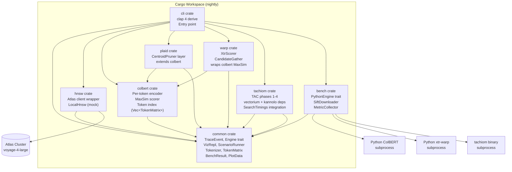
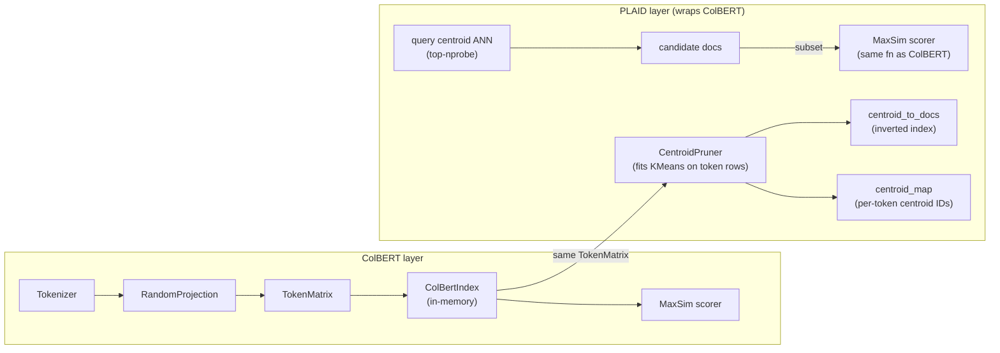
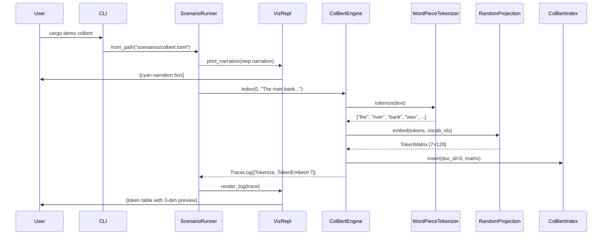
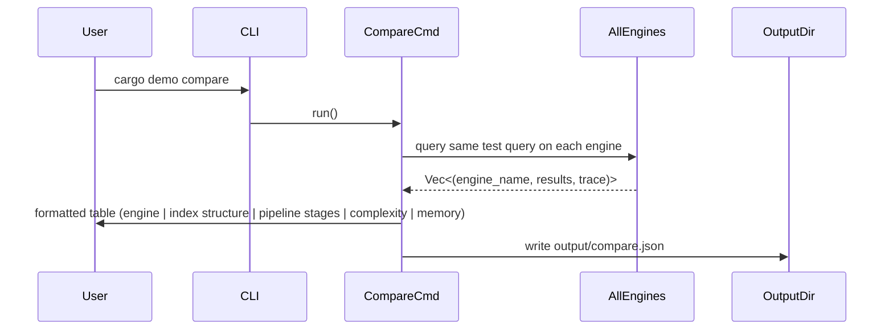

# Design: Multivector Retrieval Educational CLI

## Overview

A Rust nightly workspace (`multivector`) structured as a Cargo workspace of eight crates. The CLI teaches five retrieval engines step-by-step via TOML-driven scenarios and an interactive REPL, progressing from single-vector HNSW through ColBERTv2, PLAID, WARP, and TACHIOM. All educational implementations are fully self-contained (no Python, no ML runtime); only bench mode and HNSW's Atlas embeddings require external dependencies.

---

## Resolved Design Decisions

| Unresolved Question | Decision | Rationale |
|---------------------|----------|-----------|
| UQ-1: Embedding for edu ColBERT/PLAID/WARP/TACHIOM | Real WordPiece tokenizer + deterministic 128-dim random projection (fixed seed) | Offline, deterministic (NFR-4/NFR-7); tokenizer vocab shipped in repo so token identities are semantically stable; AC-2.2 visualizes first 3 dims |
| UQ-3: Token embedding dim | 128-dim projection matching real ColBERTv2 | Consistent with literature; viz truncates to 3 dims per AC-2.2 |
| UQ-5: Shared corpus | One shared 20-sentence corpus across all engines | Allows cross-engine ranking comparison; scenario TOML refs corpus by ID |
| UQ-2: Atlas collection schema | Collection `multivector_demo`, index `vector_index`, field `embedding` (1536-dim) | Matches research notes |
| UQ-6: SIFT download | User-supplied path via `MULTIVECTOR_SIFT_PATH` env var only; no automatic HTTP/FTP download (`reqwest` does not support FTP) | FR-12: `cargo bench check-sift` validates that SIFT files exist at `MULTIVECTOR_SIFT_PATH`; prints expected download instructions if missing |

---

## Architecture



---

## Nightly Rust and Toolchain

### `rust-toolchain.toml` (workspace root)

```toml
[toolchain]
channel = "nightly"
components = ["rustfmt", "clippy", "llvm-tools-preview"]
```

TACHIOM's upstream deps (`kannolo`, `vectorium`) use unstable features:
- `portable_simd` — SIMD abstractions not yet stable
- `iter_array_chunks` — Iterator::array_chunks not yet stable
- `stdarch_x86_mm_shuffle` — x86 intrinsic variants not yet stable

The entire workspace targets nightly so all crates compile uniformly. Individual crates do not pin nightly versions — the workspace toolchain file is the single source of truth.

### Workspace `Cargo.toml`

```toml
[workspace]
resolver = "2"
members = ["crates/common", "crates/hnsw", "crates/colbert", "crates/plaid",
           "crates/warp", "crates/tachiom", "crates/bench", "crates/cli"]

[workspace.dependencies]
tokio       = { version = "1", features = ["full"] }
anyhow      = "1"
serde       = { version = "1", features = ["derive"] }
serde_json  = "1"
toml        = "0.8"
tracing     = "0"
tracing-subscriber = { version = "0", features = ["json"] }
clap        = { version = "4", features = ["derive"] }
hnsw_rs     = "0.3"
rand        = { version = "0.8", features = ["small_rng"] }
indicatif   = "0.17"
reqwest     = { version = "0.12", features = ["stream"] }
mongodb     = { version = "3", features = ["tokio-runtime"] }
async-trait = "0.1"
tokenizers  = { version = "0.19", default-features = false, features = ["wordpiece"] }
which       = "6"
rayon       = "1"
half        = "2"
dotenvy     = "0.15"

[patch.crates-io]
# TACHIOM private deps — pinned by SHA for reproducibility
vectorium = { git = "https://github.com/TusKANNy/vectorium", rev = "REPLACE_WITH_SHA" }
kannolo   = { git = "https://github.com/TusKANNy/kannolo",   rev = "REPLACE_WITH_SHA" }
```

TACHIOM private git deps are declared in `[patch.crates-io]` at the workspace level so all crates share a single resolved version. The `tachiom` crate declares them as normal `path`-relative deps; the patch redirects to git. Substitute real SHAs once upstream is confirmed accessible.

---

## File Structure

```
multivector/
├── rust-toolchain.toml
├── Cargo.toml                    # workspace manifest
├── Cargo.lock
├── scenarios/
│   ├── hnsw.toml
│   ├── colbert.toml              # reference schema example
│   ├── plaid.toml
│   ├── warp.toml
│   ├── tachiom.toml
│   └── compare.toml
├── scripts/
│   └── plot.py
├── vocab/
│   └── wordpiece_vocab.txt       # shipped tokenizer vocab (~30k tokens)
├── output/                       # gitignored; bench/compare outputs land here
│   ├── bench_results.json
│   ├── compare.json
│   └── pareto.png
├── data/                         # gitignored; SIFT files downloaded here
│   ├── bigann_base.bvecs
│   └── bigann_groundtruth.ivecs
└── crates/
    ├── common/
    │   ├── Cargo.toml
    │   └── src/
    │       ├── lib.rs
    │       ├── trace.rs          # TraceEvent, TraceLog, JsonTracer
    │       ├── engine.rs         # Engine trait
    │       ├── token.rs          # Tokenizer trait, WordPieceTokenizer, TokenMatrix
    │       ├── viz.rs            # VizRepl, VizGuard, SuggestionMode
    │       ├── scenario.rs       # ScenarioRunner, ScenarioSchema, StepDef
    │       ├── bench_types.rs    # BenchResult, BuildStats, PlotData
    │       └── corpus.rs         # SHARED_CORPUS constant (20 sentences)
    ├── hnsw/
    │   ├── Cargo.toml
    │   └── src/
    │       ├── lib.rs
    │       ├── atlas.rs          # AtlasClient wrapper
    │       ├── local.rs          # LocalHnsw (hnsw_rs mock)
    │       ├── engine.rs         # HnswEngine impl Engine
    │       └── verify.rs         # verification harness
    ├── colbert/
    │   ├── Cargo.toml
    │   └── src/
    │       ├── lib.rs
    │       ├── encoder.rs        # WordPieceTokenizer + RandomProjection
    │       ├── index.rs          # ColBertIndex (Vec<(DocId, TokenMatrix)>)
    │       ├── maxsim.rs         # MaxSim scorer
    │       ├── engine.rs         # ColBertEngine impl Engine
    │       └── verify.rs
    ├── plaid/
    │   ├── Cargo.toml
    │   └── src/
    │       ├── lib.rs
    │       ├── centroid.rs       # CentroidPruner (KMeans over token embeddings)
    │       ├── index.rs          # PlaidIndex wraps ColBertIndex + centroid assignments
    │       ├── engine.rs         # PlaidEngine impl Engine
    │       └── verify.rs
    ├── warp/
    │   ├── Cargo.toml
    │   └── src/
    │       ├── lib.rs
    │       ├── xtr.rs            # XtrScorer
    │       ├── gather.rs         # CandidateGather
    │       ├── engine.rs         # WarpEngine impl Engine
    │       └── verify.rs
    ├── tachiom/
    │   ├── Cargo.toml
    │   └── src/
    │       ├── lib.rs
    │       ├── tac/
    │       │   ├── mod.rs
    │       │   ├── tail.rs       # TailHandler (μ, τ thresholds)
    │       │   ├── damping.rs    # DampedScorer (sⱼ, wⱼ)
    │       │   ├── budget.rs     # BudgetReconciler (ε, θ, κⱼ)
    │       │   └── clustering.rs # parallel κⱼ-means
    │       ├── pq.rs             # 3-level hierarchical PQ
    │       ├── engine.rs         # TachiomEngine impl Engine
    │       └── verify.rs
    ├── bench/
    │   ├── Cargo.toml
    │   └── src/
    │       ├── lib.rs
    │       ├── python_engine.rs  # PythonEngine trait + ColBertPython + WarpPython
    │       ├── sift.rs           # SiftDownloader
    │       ├── runner.rs         # BenchRunner orchestrates all engines
    │       └── metrics.rs        # recall@k, latency percentiles
    └── cli/
        ├── Cargo.toml
        └── src/
            ├── main.rs           # tokio runtime, top-level dispatch
            ├── commands.rs       # clap derive subcommand tree
            ├── demo.rs           # `cargo demo <engine>` → ScenarioRunner
            ├── repl.rs           # interactive REPL loop per engine
            └── compare.rs        # `cargo demo compare` table + JSON output
```

---

## `common` Crate API

### `trace.rs` — TraceEvent and TraceLog

```rust
use serde::{Deserialize, Serialize};
use std::time::Instant;

/// One named event emitted by an engine pipeline stage.
/// Each variant carries the minimum payload needed for educational display.
#[derive(Debug, Clone, Serialize, Deserialize)]
#[serde(tag = "stage", content = "payload")]
pub enum TraceEvent {
    // ── HNSW ─────────────────────────────────────────────────────────────
    HnswInsert       { doc_id: u32, layer: u8, neighbors: Vec<u32> },
    HnswQuery        { hop: u32, current: u32, candidates: Vec<(u32, f32)> },
    HnswLayerStats   { layer: u8, node_count: u32, avg_degree: f32 },

    // ── ColBERT ──────────────────────────────────────────────────────────
    Tokenize         { doc_id: u32, tokens: Vec<String> },
    TokenEmbed       { doc_id: u32, token: String, embedding_preview: [f32; 3] },
    MaxSimMatrix     { query_tokens: Vec<String>, doc_id: u32,
                       matrix: Vec<Vec<f32>>, row_maxima: Vec<f32>, score: f32 },

    // ── PLAID ────────────────────────────────────────────────────────────
    CentroidAssign   { doc_id: u32, token: String, centroid_id: u32 },
    CentroidAnn      { query_token: String, top_centroids: Vec<(u32, f32)> },
    CandidateExpand  { centroid_ids: Vec<u32>, candidate_doc_ids: Vec<u32>,
                       pruned_count: u32 },
    PlaidMaxSim      { candidate_count: u32, scored_count: u32, top_k: Vec<(u32, f32)> },

    // ── WARP ─────────────────────────────────────────────────────────────
    XtrScore         { query_token_id: u32, token_scores: Vec<(u32, f32)> },
    CandidateGather  { gathered: Vec<u32>, overlap_with_gt: f32,
                       fraction_promoted: f32 },
    MaxSimRefine     { candidate_count: u32, top_k: Vec<(u32, f32)> },

    // ── TACHIOM ──────────────────────────────────────────────────────────
    TailHandle       { token_type: String, count: u32,
                       classification: TailClass },
    DampedScore      { token_type: String, variance: f32, weight: f32 },
    BudgetBound      { token_type: String, raw_kappa: f32,
                       floored: u32, ceiled: u32, final_kappa: u32 },
    BudgetReconcile  { total_budget: u32, allocated: u32,
                       redistributed: u32 },
    PqInspect        { level: u8, dimensions: u32,
                       subquantizer_count: u32, code_bits: u8 },
    TachiomSearch    { timings: TachiomTimings },
}

#[derive(Debug, Clone, Serialize, Deserialize)]
pub enum TailClass { Tail, Normal, Heavy }

/// Mirrors TACHIOM's built-in SearchTimings struct for integration.
#[derive(Debug, Clone, Serialize, Deserialize)]
pub struct TachiomTimings {
    pub gather_ms: f64,
    pub refine_ms: f64,
    pub total_ms: f64,
}

/// Ordered sequence of trace events for one operation.
#[derive(Debug, Default, Serialize, Deserialize)]
pub struct TraceLog {
    pub events: Vec<(u64 /* epoch_ms */, TraceEvent)>,
}

impl TraceLog {
    pub fn push(&mut self, event: TraceEvent) {
        let ms = std::time::SystemTime::now()
            .duration_since(std::time::UNIX_EPOCH)
            .unwrap_or_default()
            .as_millis() as u64;
        self.events.push((ms, event));
    }
    pub fn to_json(&self) -> anyhow::Result<String> {
        Ok(serde_json::to_string_pretty(self)?)
    }
}

/// Writes a TraceLog to a file path when `--trace-json <path>` is supplied.
pub struct JsonTracer {
    pub path: std::path::PathBuf,
}
impl JsonTracer {
    pub fn write(&self, log: &TraceLog) -> anyhow::Result<()> {
        std::fs::write(&self.path, log.to_json()?)?;
        Ok(())
    }
}
```

### `engine.rs` — Engine trait

```rust
use crate::{BenchResult, TraceLog};
use anyhow::Result;

/// Implemented by every retrieval engine (educational + bench modes).
/// Async because HNSW needs Atlas network calls; others complete synchronously
/// but share the trait for uniform dispatch.
#[async_trait::async_trait]
pub trait Engine: Send + Sync {
    /// Human-readable name shown in REPL prompt and comparison table.
    fn name(&self) -> &'static str;

    /// Index a document; returns a TraceLog of events emitted.
    async fn index(&mut self, doc_id: u32, text: &str) -> Result<TraceLog>;

    /// Run a query; returns top-k (doc_id, score) pairs and a TraceLog.
    async fn query(&self, text: &str, top_k: usize) -> Result<(Vec<(u32, f32)>, TraceLog)>;

    /// Engine-specific inspect targets (e.g., "centroids", "pq", "graph").
    /// Returns a displayable string.
    async fn inspect(&self, target: Option<&str>) -> Result<String>;

    /// Run the deterministic verification harness; panics on assertion failure.
    fn verify(&mut self) -> Result<()>;
}
```

### `token.rs` — Tokenizer and TokenMatrix

```rust
use anyhow::Result;

/// A [num_tokens × DIM] matrix of per-token embeddings.
/// This is the fundamental type difference from HNSW's single Vec<f32>.
/// DIM = 128 for all educational impls matching ColBERTv2.
pub const TOKEN_DIM: usize = 128;

/// Row-major storage: embedding for token i lives at rows[i][0..TOKEN_DIM].
#[derive(Debug, Clone)]
pub struct TokenMatrix {
    pub tokens: Vec<String>,          // the actual token strings
    pub rows: Vec<[f32; TOKEN_DIM]>,  // one row per token
}

impl TokenMatrix {
    pub fn num_tokens(&self) -> usize { self.rows.len() }
    /// Returns the first 3 dimensions of token i for display (AC-2.2).
    pub fn preview(&self, i: usize) -> [f32; 3] {
        [self.rows[i][0], self.rows[i][1], self.rows[i][2]]
    }
}

/// Shared tokenizer contract. Implementations: WordPieceTokenizer.
pub trait Tokenizer: Send + Sync {
    fn tokenize(&self, text: &str) -> Vec<String>;
}

/// Real WordPiece tokenizer backed by the shipped `vocab/wordpiece_vocab.txt`.
/// Uses the `tokenizers` crate (HuggingFace, pure Rust).
pub struct WordPieceTokenizer {
    inner: tokenizers::Tokenizer,
}

impl WordPieceTokenizer {
    /// Load vocab from path. Called once at startup.
    pub fn from_vocab(vocab_path: &std::path::Path) -> Result<Self> {
        let inner = tokenizers::Tokenizer::from_file(vocab_path)
            .map_err(|e| anyhow::anyhow!("tokenizer load: {e}"))?;
        Ok(Self { inner })
    }
}

impl Tokenizer for WordPieceTokenizer {
    fn tokenize(&self, text: &str) -> Vec<String> {
        let enc = self.inner.encode(text, false).unwrap();
        enc.get_tokens().to_vec()
    }
}

/// Deterministic fixed-weight linear projection: token_id → 128-dim vector.
/// Seed is fixed (0xCAFEBABE_DEADBEEF) so outputs are byte-identical across runs (NFR-4).
/// Uses SmallRng seeded from the token's WordPiece vocab ID — one projection
/// per token type, cached after first computation.
pub struct RandomProjection {
    seed: u64,
    cache: std::collections::HashMap<u32, [f32; TOKEN_DIM]>,
}

impl RandomProjection {
    pub fn new(seed: u64) -> Self {
        Self { seed, cache: Default::default() }
    }

    /// Returns a deterministic 128-dim unit vector for a vocab token ID.
    /// Uses Gaussian entries with SmallRng(seed XOR token_id) then L2-normalizes.
    pub fn project(&mut self, token_id: u32) -> [f32; TOKEN_DIM] {
        if let Some(cached) = self.cache.get(&token_id) {
            return *cached;
        }
        use rand::{Rng, SeedableRng};
        use rand::rngs::SmallRng;
        let mut rng = SmallRng::seed_from_u64(self.seed ^ token_id as u64);
        let mut v = [0f32; TOKEN_DIM];
        for x in v.iter_mut() { *x = rng.gen::<f32>() * 2.0 - 1.0; }
        // L2 normalize
        let norm = v.iter().map(|x| x * x).sum::<f32>().sqrt().max(1e-9);
        for x in v.iter_mut() { *x /= norm; }
        self.cache.insert(token_id, v);
        v
    }

    /// Embed a full token sequence → TokenMatrix.
    pub fn embed(
        &mut self,
        tokenizer: &dyn Tokenizer,
        vocab_ids: &[u32],
        tokens: &[String],
    ) -> TokenMatrix {
        let rows: Vec<[f32; TOKEN_DIM]> = vocab_ids.iter()
            .map(|&id| self.project(id))
            .collect();
        TokenMatrix { tokens: tokens.to_vec(), rows }
    }
}
```

**Critical architectural note on TokenMatrix vs. single vector:**
- HNSW stores one `Vec<f32>` (1536-dim) per document.
- All multivector engines store one `TokenMatrix` (`n_tokens × 128`) per document.
- A document with 12 tokens contributes 12 separate 128-dim points to the index, not 1.
- MaxSim operates over this matrix at query time without cross-attention.

### `viz.rs` — VizRepl and SuggestionMode

```rust
use std::io::{self, Write};

/// Controls whether the renderer is active.
/// Drop restores rendering — RAII pattern from mini-aurora.
pub struct VizGuard {
    suppressed: bool,
}
impl VizGuard {
    pub fn suppress() -> Self { Self { suppressed: true } }
}
impl Drop for VizGuard {
    fn drop(&mut self) { /* restore terminal state */ }
}

/// Drives the post-command suggestion flow. Sequence variant yields
/// suggestions in order, looping to 0 after the last.
#[derive(Debug, Default)]
pub enum SuggestionMode {
    #[default]
    None,
    Sequence { suggestions: Vec<String>, index: usize },
}

impl SuggestionMode {
    pub fn next_suggestion(&mut self) -> Option<&str> {
        if let SuggestionMode::Sequence { suggestions, index } = self {
            if suggestions.is_empty() { return None; }
            let s = suggestions[*index].as_str();
            *index = (*index + 1) % suggestions.len();
            Some(s)
        } else { None }
    }
}

/// Shared REPL scaffolding. Each engine provides its command handler;
/// VizRepl handles the read-print loop, suggestion printing, and help.
pub struct VizRepl {
    pub engine_name: &'static str,
    pub suggestions: SuggestionMode,
    pub trace_path: Option<std::path::PathBuf>, // --trace-json target
}

impl VizRepl {
    /// Print suggestion line after each command output.
    pub fn print_suggestion(&mut self) {
        if let Some(s) = self.suggestions.next_suggestion() {
            println!("\n  \x1b[2m→ try: {s}\x1b[0m");
        }
    }

    /// Print narration text with visual separator (used by ScenarioRunner).
    pub fn print_narration(text: &str) {
        println!("\n\x1b[36m━━━━━━━━━━━━━━━━━━━━━━━━━━━━━━━━━━\x1b[0m");
        println!("\x1b[36m  {text}\x1b[0m");
        println!("\x1b[36m━━━━━━━━━━━━━━━━━━━━━━━━━━━━━━━━━━\x1b[0m\n");
    }
}
```

### `scenario.rs` — ScenarioRunner and typed TOML schema

```rust
use serde::{Deserialize, Serialize};

#[derive(Debug, Deserialize)]
pub struct ScenarioFile {
    pub meta:   ScenarioMeta,
    pub corpus: CorpusDef,
    pub steps:  Vec<StepDef>,
}

#[derive(Debug, Deserialize)]
pub struct ScenarioMeta {
    pub title:       String,
    pub engine:      String,    // "hnsw" | "colbert" | "plaid" | "warp" | "tachiom"
    pub description: String,
    pub version:     u32,       // schema version; currently 1
}

#[derive(Debug, Deserialize)]
#[serde(tag = "type", rename_all = "lowercase")]
pub enum CorpusDef {
    /// Use the shared 20-sentence corpus built into common::corpus.
    /// TOML: [corpus]\n type = "shared"
    Shared,
    /// Inline documents; each is a (id, text) pair.
    /// TOML: [corpus]\n type = "inline"\n docs = [...]
    Inline { docs: Vec<InlineDoc> },
    /// Path to a text file; one document per line.
    /// TOML: [corpus]\n type = "file"\n path = "..."
    File   { path: String },
}

#[derive(Debug, Deserialize)]
pub struct InlineDoc {
    pub id:   u32,
    pub text: String,
}

#[derive(Debug, Deserialize)]
pub struct StepDef {
    /// REPL command name: "index" | "query" | "inspect" | "trace" | "bench"
    pub op:        String,
    /// Arguments passed to the command (e.g., the query string).
    pub args:      Vec<String>,
    /// Narration printed before the step executes.
    pub narration: String,
    /// Optional: pause after narration for the reader to press Enter.
    #[serde(default)]
    pub pause:     bool,
}

pub struct ScenarioRunner {
    pub scenario: ScenarioFile,
    pub dry_run:  bool,
}

impl ScenarioRunner {
    pub fn from_path(path: &std::path::Path) -> anyhow::Result<Self> {
        let raw = std::fs::read_to_string(path)?;
        let scenario: ScenarioFile = toml::from_str(&raw)
            .map_err(|e| anyhow::anyhow!("scenario parse error: {e}"))?;
        // Schema version check
        if scenario.meta.version != 1 {
            anyhow::bail!("unsupported scenario version {}", scenario.meta.version);
        }
        Ok(Self { scenario, dry_run: false })
    }

    /// Execute steps sequentially. Calls engine dispatch fn for each op.
    pub async fn run<F, Fut>(&self, mut dispatch: F) -> anyhow::Result<()>
    where
        F: FnMut(String, Vec<String>) -> Fut,
        Fut: std::future::Future<Output = anyhow::Result<()>>,
    {
        for step in &self.scenario.steps {
            VizRepl::print_narration(&step.narration);
            if self.dry_run { continue; }
            dispatch(step.op.clone(), step.args.clone()).await?;
        }
        Ok(())
    }
}
```

### `bench_types.rs` — BenchResult, BuildStats, PlotData

```rust
use serde::{Deserialize, Serialize};

#[derive(Debug, Clone, Serialize, Deserialize)]
pub struct BenchResult {
    pub engine:       String,
    pub dataset:      String,          // "sift1m" | "sift100m"
    pub recall_at_1:  f64,
    pub recall_at_10: f64,
    pub recall_at_100:f64,
    pub p50_ms:       f64,
    pub p95_ms:       f64,
    pub p99_ms:       f64,
    pub qps:          f64,
    pub index_build_s:f64,
    pub peak_ram_mb:  f64,
}

#[derive(Debug, Clone, Serialize, Deserialize)]
pub struct BuildStats {
    pub duration_s: f64,
    pub doc_count:  u64,
    pub index_size_bytes: u64,
}

/// Data passed to scripts/plot.py.
#[derive(Debug, Serialize, Deserialize)]
pub struct PlotData {
    pub results: Vec<BenchResult>,
}
```

### `corpus.rs` — Shared 20-sentence corpus

The same 20 sentences are used across all five engine demos and all verification harnesses. They exploit finance/geography word-sense ambiguity so the same surface form ("bank", "trunk", "light", etc.) appears in contradictory semantic contexts — making retrieval quality differences between engines observable.

```rust
/// (doc_id, text) pairs. doc_id is stable and referenced by scenario TOML.
pub const SHARED_CORPUS: &[(u32, &str)] = &[
    (0,  "The river bank was slippery after the spring flood receded."),
    (1,  "She opened a savings account at the bank downtown."),
    (2,  "The logging truck carried a full trunk of oak timber."),
    (3,  "He packed his winter clothes into the car trunk before the road trip."),
    (4,  "The surgeon operated on the nerve trunk in the patient's lower back."),
    (5,  "The hiking trail runs along the left bank of the Colorado River."),
    (6,  "Interest rates at the central bank rose sharply this quarter."),
    (7,  "The elephant wrapped its trunk around the tree to pull it down."),
    (8,  "She wore a light cotton dress on the warm summer afternoon."),
    (9,  "The physics lab measured the speed of light using interferometry."),
    (10, "The crane operator lowered the steel beam with precision."),
    (11, "The paper crane origami requires 25 precise folds."),
    (12, "Venture capital firms invested heavily in financial technology startups."),
    (13, "The geological fault line runs beneath the river delta."),
    (14, "He pitched the tent on the flat bank beside the stream."),
    (15, "The investment bank underwrote the government bond issuance."),
    (16, "The trunk road connects the capital city to the northern province."),
    (17, "Scientists detected gravitational waves using laser light pulses."),
    (18, "A flock of cranes migrated south along the river valley."),
    (19, "The reserve bank adjusted monetary policy after the inflation report."),
];

/// Ground-truth top-1 document per query (used by all verify modules).
/// Query → expected doc_id.
pub const VERIFY_QUERIES: &[(&str, u32)] = &[
    ("river erosion along the bank",              0),
    ("open a checking account at the bank",        1),
    ("lumber loaded on a logging truck",           2),
    ("packing luggage into the car before travel", 3),
    ("neural trunk anatomy in spinal surgery",     4),
    ("hiking trail beside a river",                5),
    ("central bank interest rate decision",        6),
    ("elephant using its trunk",                   7),
    ("summer fashion lightweight clothing",        8),
    ("speed of light measurement experiment",      9),
    ("construction crane lifting steel",           10),
    ("paper folding origami bird",                 11),
    ("fintech startup venture funding",            12),
    ("geological fault beneath river delta",       13),
    ("tent camping beside a stream",               14),
    ("bond underwriting investment banking",       15),
    ("arterial road connecting cities",            16),
    ("laser light pulse experiment",               17),
    ("bird migration along river valley",          18),
    ("monetary policy inflation central bank",     19),
];
```

---

## REPL Command Dispatch

### clap subcommand tree (`cli/src/commands.rs`)

```rust
use clap::{Parser, Subcommand};

#[derive(Parser)]
#[command(name = "multivector", version, about = "Multivector retrieval educational CLI")]
pub struct Cli {
    #[command(subcommand)]
    pub command: TopCommand,

    /// Write trace events to JSON file.
    #[arg(long, global = true)]
    pub trace_json: Option<std::path::PathBuf>,
}

#[derive(Subcommand)]
pub enum TopCommand {
    /// Run a TOML scenario end-to-end.
    Demo {
        /// Scenario name (resolves scenarios/<name>.toml) or "compare".
        name: String,
        #[arg(long)]
        dry_run: bool,
    },
    /// Open an interactive REPL for one engine.
    Repl {
        #[command(subcommand)]
        engine: EngineCmd,
    },
    /// Run benchmarks.
    Bench {
        #[command(subcommand)]
        target: BenchTarget,
    },
}

#[derive(Subcommand)]
pub enum EngineCmd {
    Hnsw,
    Colbert,
    Plaid,
    Warp,
    Tachiom,
}

#[derive(Subcommand)]
pub enum BenchTarget {
    All,
    Hnsw,
    Colbert,
    Plaid,
    Warp,
    Tachiom,
    /// Validate that SIFT files exist at MULTIVECTOR_SIFT_PATH; prints download instructions if missing.
    CheckSift,
}
```

### REPL inner command grammar (parsed per-line inside the REPL loop)

These are not clap subcommands — they are parsed by a simple tokenizer inside `VizRepl`:

| Command | Arguments | Engines |
|---------|-----------|---------|
| `index <text>` | Free-form text | All |
| `query <text>` | Free-form text | All |
| `inspect` | Optional: `centroids`, `pq`, `graph`, `layers` | Per-engine |
| `trace [filter]` | Optional stage name filter | All |
| `bench` | None | WARP, TACHIOM |
| `help` | None | All |
| `quit` | None | All |

Each engine's `Engine::inspect` impl accepts `Option<&str>` for the target. Unknown targets print available options.

### VizRepl dispatch loop (`cli/src/repl.rs`)

```rust
pub async fn run_repl(engine: &mut dyn Engine, mut viz: VizRepl) -> anyhow::Result<()> {
    println!("  {} REPL — type 'help' for commands", engine.name());
    let stdin = io::stdin();
    loop {
        print!("{}> ", engine.name());
        io::stdout().flush()?;
        let mut line = String::new();
        if stdin.lock().read_line(&mut line)? == 0 { break; } // EOF
        let parts: Vec<&str> = line.trim().splitn(2, ' ').collect();
        match parts.as_slice() {
            ["quit"] | ["exit"] | ["q"] => break,
            ["help"] | ["h"]           => print_help(engine.name()),
            ["index", rest]            => {
                let log = engine.index(next_doc_id(), rest).await?;
                render_log(&log);
            },
            ["query", rest]            => {
                let (results, log) = engine.query(rest, 10).await?;
                render_results(&results);
                render_log(&log);
            },
            ["inspect"]                => {
                let out = engine.inspect(None).await?;
                println!("{out}");
            },
            ["inspect", target]        => {
                let out = engine.inspect(Some(target)).await?;
                println!("{out}");
            },
            ["trace"]                  => { /* replay last TraceLog */ },
            ["trace", filter]          => { /* replay filtered */ },
            _                          => eprintln!("unknown command; type 'help'"),
        }
        viz.print_suggestion();
    }
    Ok(())
}
```

---

## Per-Engine Crate Designs

### HNSW Crate (`crates/hnsw`)

**Purpose:** Educational HNSW demo backed by a real Atlas cluster for embedding + graph operations.

```
Module layout:
  atlas.rs     — AtlasClient: wraps mongodb crate, calls voyage-4-large via Atlas
  local.rs     — LocalHnsw: wraps hnsw_rs with fixed 1536-dim mock vectors for verify
  engine.rs    — HnswEngine: impl Engine, delegates to atlas or local depending on cfg
  verify.rs    — uses LocalHnsw + SHARED_CORPUS + VERIFY_QUERIES
```

#### AtlasClient (`hnsw/src/atlas.rs`)

```rust
pub struct AtlasClient {
    client:     mongodb::Client,
    collection: mongodb::Collection<mongodb::bson::Document>,
    index_name: &'static str,   // "vector_index"
}

impl AtlasClient {
    pub async fn connect(uri: &str) -> anyhow::Result<Self> { ... }

    /// Embed text via Atlas voyage-4-large, store document, return 1536-dim vector.
    pub async fn index_doc(&self, doc_id: u32, text: &str) -> anyhow::Result<Vec<f32>> { ... }

    /// $vectorSearch aggregation; returns (doc_id, score, candidates traversed).
    pub async fn query(&self, embedding: Vec<f32>, top_k: usize)
        -> anyhow::Result<Vec<(u32, f32)>> { ... }

    /// Returns layer-by-layer graph stats for the index (via $listIndexes + stats).
    pub async fn graph_stats(&self) -> anyhow::Result<Vec<HnswLayerStat>> { ... }
}
```

Atlas collection schema:
- Collection: `multivector_demo`
- Index name: `vector_index`
- Document fields: `{ doc_id: Int32, text: String, embedding: [Float] }` (1536 floats — full-precision stored for rescoring)
- Atlas Vector Search index definition:

```json
{
  "fields": [
    {
      "type": "vector",
      "path": "embedding",
      "numDimensions": 1536,
      "similarity": "cosine",
      "quantization": "binary"
    }
  ],
  "storedSource": {
    "include": ["embedding", "doc_id", "text"]
  }
}
```

Binary quantization compresses the HNSW index to ~4% of float32 RAM. `storedSource` retains the original float32 vectors for exact rescoring after ANN retrieval. The `$vectorSearch` aggregation must pass `oversampling: 10` (or equivalent `numCandidates = limit * 10`) to compensate for binary quantization precision loss.

#### LocalHnsw (`hnsw/src/local.rs`)

Uses `hnsw_rs` crate. Fixed 1536-dim mock vectors generated by `RandomProjection` with `TOKEN_DIM=1536` override (only for HNSW verification — all other engines use 128-dim). Seeded identically to satisfy NFR-4.

#### TraceEvents emitted: `HnswInsert`, `HnswQuery`, `HnswLayerStats`

---

### ColBERT Crate (`crates/colbert`)

**Purpose:** Educational per-token embedding + MaxSim scoring. Foundation for PLAID and WARP.

```
Module layout:
  encoder.rs   — WordPieceTokenizer + RandomProjection (delegates to common::token)
  index.rs     — ColBertIndex: Vec<(DocId, TokenMatrix)>; in-memory
  maxsim.rs    — MaxSim scorer function
  engine.rs    — ColBertEngine: impl Engine
  verify.rs    — deterministic test with SHARED_CORPUS
```

#### ColBertIndex (`colbert/src/index.rs`)

```rust
pub struct ColBertIndex {
    /// One TokenMatrix per indexed document.
    pub docs: Vec<(u32 /* doc_id */, TokenMatrix)>,
}

impl ColBertIndex {
    pub fn insert(&mut self, doc_id: u32, matrix: TokenMatrix) { ... }

    /// Brute-force MaxSim over all documents. Educational — no ANN.
    pub fn search(&self, query_matrix: &TokenMatrix, top_k: usize)
        -> Vec<(u32, f32)> { ... }
}
```

**Note on AC-2.1:** The acceptance criterion states "HNSW insertion per token."
The educational implementation uses an in-memory Vec<(DocId, TokenMatrix)>
rather than a per-token HNSW shard, because the full HNSW-per-token variant
would duplicate the PLAID and TACHIOM index structures without adding
educational clarity at the ColBERT stage. The `index` REPL command
still emits a `HnswInsert`-style TraceEvent per token showing the insertion
"path" conceptually (doc_id, token position, embedding preview). AC-2.2
("REPL shows each token's embedding coordinates") is fully satisfied.
The REPL narration explicitly labels this as "ColBERT's logical insertion,
not yet an ANN graph — that comes in PLAID."

#### MaxSim scorer (`colbert/src/maxsim.rs`)

```rust
/// MaxSim(Q, D) = Σ_i max_j cosine(Q[i], D[j])
/// Q: query TokenMatrix, D: doc TokenMatrix
pub fn maxsim(query: &TokenMatrix, doc: &TokenMatrix) -> f32 {
    query.rows.iter().map(|q_tok| {
        doc.rows.iter()
            .map(|d_tok| cosine(q_tok, d_tok))
            .fold(f32::NEG_INFINITY, f32::max)
    }).sum()
}

fn cosine(a: &[f32; TOKEN_DIM], b: &[f32; TOKEN_DIM]) -> f32 {
    // Both are L2-normalized from RandomProjection → dot product = cosine.
    a.iter().zip(b.iter()).map(|(x, y)| x * y).sum()
}
```

#### TraceEvents emitted: `Tokenize`, `TokenEmbed`, `MaxSimMatrix`

#### Suggestions for ColBERT REPL (`SuggestionMode::Sequence`)

```
"query bank" → "inspect" → "trace maxsim" → "query river"
```

---

### PLAID Crate (`crates/plaid`)

**Purpose:** Progressive enhancement of ColBERT — adds `CentroidPruner` layer; reuses ColBERT's token embeddings directly.

**Key design principle (AC-3.5, FR-8):** `PlaidEngine` holds a `ColBertEngine` instance and calls `colbert.index()` during its own indexing step. The centroid assignments are computed *over the same token embeddings* ColBERT produces. PLAID does not re-embed — it only adds the pruning layer.

```rust
// plaid/src/index.rs
pub struct PlaidIndex {
    /// Underlying ColBERT token storage — shared, not duplicated.
    pub colbert: colbert::ColBertIndex,
    /// Centroid vectors learned via KMeans over all token embeddings.
    pub centroids: Vec<[f32; TOKEN_DIM]>,  // shape: [num_centroids × 128]
    /// For each token in each doc: which centroid it belongs to.
    /// centroid_map[doc_id] = Vec<centroid_id per token>
    pub centroid_map: Vec<Vec<u32>>,
    /// Inverted index: centroid_id → list of doc_ids.
    pub centroid_to_docs: Vec<Vec<u32>>,
}
```

#### CentroidPruner (`plaid/src/centroid.rs`)

```rust
pub struct CentroidPruner {
    pub num_centroids: usize,  // 32 for small corpus; 4096 for PLAID at scale
}

impl CentroidPruner {
    /// Fit centroids via Lloyd's algorithm over all token embeddings in the index.
    /// Uses a fixed seed for determinism (NFR-4).
    pub fn fit(&self, all_token_rows: &[[f32; TOKEN_DIM]]) -> Vec<[f32; TOKEN_DIM]> { ... }

    /// Assign each token to its nearest centroid.
    pub fn assign(&self, centroids: &[[f32; TOKEN_DIM]], token: &[f32; TOKEN_DIM]) -> u32 { ... }

    /// For a query token, find the top-nprobe nearest centroids.
    pub fn query_centroids(&self, centroids: &[[f32; TOKEN_DIM]],
                           query_token: &[f32; TOKEN_DIM], nprobe: usize)
        -> Vec<(u32, f32)> { ... }
}
```

#### PLAID query pipeline

1. For each query token: find top-nprobe centroids (emits `CentroidAnn`)
2. Union all doc_ids assigned to those centroids (emits `CandidateExpand`)
3. Run MaxSim only on candidate set (emits `PlaidMaxSim`)

#### TraceEvents emitted: `CentroidAssign`, `CentroidAnn`, `CandidateExpand`, `PlaidMaxSim`

---

### WARP Crate (`crates/warp`)

**Purpose:** Xtr-based gather phase replaces PLAID's centroid ANN; reuses ColBERT's MaxSim for refinement.

**Key contrast with PLAID (AC-4.4):** PLAID queries centroids per query token to find candidate docs. WARP instead computes lightweight Xtr scores (dot product of query token against a compressed token index) and gathers docs whose any token scores above a threshold, without centroid distance computation.

```
Module layout:
  xtr.rs       — XtrScorer: dot product of query tokens against token ID lookup table
  gather.rs    — CandidateGather: threshold-based filtering of Xtr scores
  engine.rs    — WarpEngine: holds ColBertIndex + XtrScorer; impl Engine
  verify.rs
```

#### XtrScorer (`warp/src/xtr.rs`)

```rust
/// Xtr scoring: for each query token embedding, compute dot product against
/// a compressed representation of each indexed token (ColBERT token_id lookup).
/// This is a simplified educational version; real WARP uses fused_ext CUDA ops.
pub struct XtrScorer {
    /// For each doc: list of (token_string, vocab_id).
    token_registry: Vec<Vec<(String, u32)>>,
    /// Projection matrix for Xtr scores (same RandomProjection as encoder).
    projection: RandomProjection,
}

impl XtrScorer {
    /// Returns (doc_id, xtr_score) for all docs above t_prime threshold.
    pub fn score(&mut self, query_matrix: &TokenMatrix, t_prime: f32,
                 bound: usize) -> Vec<(u32, f32)> {
        // For each query token q_i, for each doc d:
        //   xtr(q_i, d) = max over d's tokens of dot(q_i, token_embedding)
        // Aggregate: gather docs where any xtr score > t_prime.
        // Truncate to top-bound by xtr score.
        ...
    }
}
```

#### WARP query pipeline

1. Compute Xtr scores for all docs (emits `XtrScore` per query token)
2. Gather candidates above `t_prime` threshold, bounded by `bound` (emits `CandidateGather`)
3. Run full MaxSim on gathered candidates (emits `MaxSimRefine`)

#### TraceEvents emitted: `XtrScore`, `CandidateGather`, `MaxSimRefine`

#### Bench mode

`WarpEngine::bench()` checks for `xtr-warp` on `$PATH`, builds a subprocess invocation, and delegates to `bench::PythonEngine`.

---

### TACHIOM Crate (`crates/tachiom`)

**Purpose:** Token-Aware Clustering — each token type gets its own κⱼ centroids. Uses `vectorium` and `kannolo` git deps. Requires nightly.

```
Module layout:
  tac/
    tail.rs       — TailHandler
    damping.rs    — DampedScorer
    budget.rs     — BudgetReconciler
    clustering.rs — parallel κⱼ-means using rayon
  pq.rs           — 3-level hierarchical PQ
  engine.rs       — TachiomEngine: impl Engine; wraps Tachiom<32>
  verify.rs
```

#### Cargo.toml for tachiom crate

```toml
[dependencies]
common    = { path = "../common" }
vectorium = { git = "https://github.com/TusKANNy/vectorium", rev = "REPLACE_SHA" }
kannolo   = { git = "https://github.com/TusKANNy/kannolo",   rev = "REPLACE_SHA" }
rayon     = { workspace = true }
anyhow    = { workspace = true }
serde     = { workspace = true }
```

Nightly features needed in `tac/clustering.rs`:
```rust
#![feature(portable_simd)]
#![feature(iter_array_chunks)]
```

#### TAC Phase 1 — Tail Handling (`tachiom/src/tac/tail.rs`)

```rust
/// μ=128: tail threshold (fewer occurrences → merge into global pool)
/// τ=256: heavy threshold (more occurrences → own centroid budget)
pub const MU: u32 = 128;
pub const TAU: u32 = 256;

pub struct TailHandler {
    /// token_type_id → frequency count across corpus
    pub freq: std::collections::HashMap<u32, u32>,
}

impl TailHandler {
    pub fn classify(&self, token_type_id: u32) -> TailClass {
        match self.freq.get(&token_type_id).copied().unwrap_or(0) {
            n if n < MU  => TailClass::Tail,
            n if n > TAU => TailClass::Heavy,
            _            => TailClass::Normal,
        }
    }
    /// Emit TailHandle trace events for all token types.
    pub fn trace_all(&self) -> Vec<TraceEvent> { ... }
}
```

#### TAC Phase 2 — Damped Scoring (`tachiom/src/tac/damping.rs`)

```rust
/// sⱼ = variance of token type j's embeddings
/// wⱼ = √nⱼ · sⱼ  (damped weight; nⱼ = frequency)
pub fn damped_weight(variance: f32, freq: u32) -> f32 {
    (freq as f32).sqrt() * variance
}

pub struct DampedScorer {
    pub weights: std::collections::HashMap<u32 /* token_type */, f32 /* wⱼ */>,
}
```

#### TAC Phase 3 — Budget Bounding (`tachiom/src/tac/budget.rs`)

```rust
pub const EPSILON: u32 = 4;   // floor: κⱼ ≥ ε
pub const THETA:   u32 = 39;  // ceiling: κⱼ ≤ θ

pub struct BudgetReconciler {
    pub total_budget: u32,  // total centroids across all token types
}

impl BudgetReconciler {
    /// Compute raw κⱼ from wⱼ proportional allocation, then apply ε/θ.
    pub fn allocate(&self, weights: &std::collections::HashMap<u32, f32>)
        -> std::collections::HashMap<u32, u32> { ... }

    /// Redistribute leftover budget (after floor/ceiling) to token types
    /// that hit the ceiling and have excess weight.
    pub fn reconcile(&mut self, raw: &mut std::collections::HashMap<u32, u32>) { ... }
}
```

#### TAC Phase 4 — Parallel κⱼ-means (`tachiom/src/tac/clustering.rs`)

```rust
/// Run independent KMeans for each token type with its assigned κⱼ centroids.
/// Uses rayon par_iter for parallelism.
pub fn parallel_kappa_means(
    token_type_embeddings: &std::collections::HashMap<u32, Vec<[f32; TOKEN_DIM]>>,
    kappa: &std::collections::HashMap<u32, u32>,
    seed: u64,
) -> std::collections::HashMap<u32, Vec<[f32; TOKEN_DIM]>> {
    use rayon::prelude::*;
    token_type_embeddings.par_iter().map(|(token_type_id, embeddings)| {
        let k = *kappa.get(token_type_id).unwrap_or(&EPSILON);
        let centroids = kmeans(embeddings, k as usize, seed ^ *token_type_id as u64);
        (*token_type_id, centroids)
    }).collect()
}
```

#### 3-Level Hierarchical PQ (`tachiom/src/pq.rs`)

| Level | Purpose | Dimensions | Sub-quantizers | Code size |
|-------|---------|------------|----------------|-----------|
| 0 | Coarse (centroid residuals) | 128 | 8 | 1 byte (256 codes) |
| 1 | Mid (intra-cluster) | 64 | 4 | 1 byte |
| 2 | Fine (within-cell) | 32 | 2 | 1 byte |

```rust
pub struct HierarchicalPQ {
    pub levels: [PQLevel; 3],
}
pub struct PQLevel {
    pub dimensions: u32,
    pub num_subquantizers: u32,
    pub code_bits: u8,
    pub codebook: Vec<Vec<[f32; 16]>>,  // [subquantizer × 256 × (dim/subq)]
}
```

#### SearchTimings integration

`vectorium::SearchTimings` is used directly as the data source for `TachiomTimings`. The `TachiomEngine` converts `SearchTimings` to `TraceEvent::TachiomSearch` after each search.

#### TraceEvents emitted: `TailHandle`, `DampedScore`, `BudgetBound`, `BudgetReconcile`, `PqInspect`, `TachiomSearch`

---

## PLAID as Progressive Enhancement of ColBERT

This is a critical pedagogical and architectural point:



- `PlaidEngine::index()` calls `ColBertEngine::index()` first, then assigns centroids to the resulting `TokenMatrix`.
- The same `maxsim()` function from `colbert::maxsim` is called by PLAID — PLAID is a filter, not a replacement scorer.
- TOML scenario for PLAID (`plaid.toml`) loads documents via the same `corpus` block as `colbert.toml` — same 20 sentences, same doc IDs.

---

## Token Encoder Design: Why Fixed Random Projection is Architecturally Correct

Real ColBERTv2 uses a fine-tuned BERT model with 128-dim projections. For the educational impl:

1. **Per-token output preserved**: `RandomProjection::embed()` returns a `TokenMatrix` with one 128-dim row per WordPiece token — structurally identical to what a real BERT-based encoder produces.
2. **Dimensionality matches**: 128-dim matches the ColBERTv2 paper, so all numerical descriptions (MaxSim scores, centroid distances) are plausible.
3. **No semantic meaning** is claimed: the demo narration explains that the projection is illustrative. The word-sense ambiguity corpus (bank/river, trunk/elephant) still creates *interesting* token distributions because WordPiece tokenizes them identically, and the same vocab ID maps to the same projection — so "bank" always maps to the same 128-dim point. Two different surface words will differ in their projections.
4. **NFR-7 preserved**: No `candle`, `ort`, `tch` in Cargo.lock.
5. **NFR-4 preserved**: Fixed seed → byte-identical embeddings across runs.

The `tokenizers` crate (HuggingFace, pure Rust, MIT) handles WordPiece tokenization using the shipped `vocab/wordpiece_vocab.txt`. This is a data file dependency, not an ML runtime.

---

## TOML Scenario Schema

Full typed schema with all fields. Reference example: `scenarios/colbert.toml`.

```toml
# scenarios/colbert.toml — REFERENCE SCHEMA EXAMPLE

[meta]
title       = "ColBERTv2 Late Interaction: Per-Token Embeddings and MaxSim"
engine      = "colbert"
description = """
Walk through how ColBERT indexes a document token by token, then scores
a query using the MaxSim function. Contrast with HNSW's single-vector approach.
"""
version     = 1

# Use the shared 20-sentence corpus — no inline docs needed.
[corpus]
type = "shared"

# Each step maps to one REPL command.
# op must be one of: "index", "query", "inspect", "trace"
# args is a list of strings passed to the command.

[[steps]]
op        = "index"
args      = ["0"]    # index doc_id 0 from shared corpus
narration = """
HNSW stores one vector per document. When the document says 'The river bank
was slippery', HNSW produces a single point in embedding space — the token
'bank' and the token 'river' collapse into one average representation.

ColBERT keeps them separate. Watch what happens when we index document 0.
"""

[[steps]]
op        = "inspect"
args      = ["tokens", "0"]    # show TokenMatrix for doc 0
narration = """
Each token gets its own 128-dimensional embedding. The token 'bank' (row 3)
sits at a completely different position than 'river' (row 2). When a query
asks about financial institutions, 'bank' will score high against the matching
query token, while 'river' will score near zero. MaxSim picks the max — so
the document still retrieves correctly even with one ambiguous token.
"""

[[steps]]
op        = "index"
args      = ["1"]    # index doc_id 1: savings account at the bank downtown
narration = """
Now index document 1: 'She opened a savings account at the bank downtown.'
This document's 'bank' token maps to the same vocab ID as document 0's 'bank' —
so their 'bank' embeddings are identical (fixed projection is token-type-based).
The rest of the tokens differ. MaxSim will separate them by query.
"""

[[steps]]
op        = "query"
args      = ["river erosion along the bank"]
narration = """
Query: 'river erosion along the bank'. The query is also tokenized into per-token
embeddings. For each query token, MaxSim finds the document token with highest
cosine similarity. The row maxima are summed to produce the final score.

Watch the MaxSimMatrix: doc 0 (river bank) should outscore doc 1 (savings account)
because query tokens like 'river' and 'erosion' find better matches in doc 0.
"""
pause     = true

[[steps]]
op        = "query"
args      = ["open a checking account at the bank"]
narration = """
Now reverse the query: 'open a checking account at the bank'.
Doc 1 should outscore doc 0 — even though both contain the token 'bank' —
because query tokens 'account' and 'checking' find strong matches only in doc 1.

This is the core insight: MaxSim lets each query token find its BEST match
independently. A single-vector model (HNSW) would mix these signals together.
"""
pause     = true

[[steps]]
op        = "trace"
args      = []
narration = """
The TraceLog above shows every event fired during the last query. You can see
the Tokenize event, then one TokenEmbed per token, then the MaxSimMatrix event
with the full matrix. Each stage corresponds to a ColBERT pipeline step.

In the next demo (PLAID), we add a pruning step between tokenization and MaxSim.
Run: cargo demo plaid
"""
```

### Scenario schema validation rules

| Field | Type | Required | Validation |
|-------|------|----------|------------|
| `meta.title` | String | Yes | non-empty |
| `meta.engine` | String | Yes | one of: hnsw, colbert, plaid, warp, tachiom, compare |
| `meta.version` | u32 | Yes | must equal 1 |
| `meta.description` | String | Yes | non-empty |
| `corpus` | Table | Yes | Table with `type` discriminator; `type` must be one of: `shared`, `inline`, `file` |
| `steps[].op` | String | Yes | one of: index, query, inspect, trace, bench |
| `steps[].args` | Array of strings | Yes | may be empty; engine validates |
| `steps[].narration` | String | Yes | non-empty |
| `steps[].pause` | bool | No | default false |

---

## Atlas Integration Design

### Connection (`hnsw/src/atlas.rs`)

```rust
pub async fn from_env() -> anyhow::Result<AtlasClient> {
    // Load .env if present (dotenvy crate; no-op if file is absent)
    let _ = dotenvy::dotenv();
    let uri = std::env::var("MONGODB_URI")
        .map_err(|_| anyhow::anyhow!(
            "MONGODB_URI is not set. Add it to .env or export it.\n\
             Non-HNSW engines do not require Atlas."
        ))?;
    let client = mongodb::Client::with_uri_str(&uri).await?;
    let db = client.database("multivector");
    let collection = db.collection::<mongodb::bson::Document>("multivector_demo");
    Ok(AtlasClient { client, collection, index_name: "vector_index" })
}
```

### Embedding call

Atlas Data API is not used. Instead, the `hnsw` crate calls the `$vectorSearch` aggregation pipeline operator directly via the `mongodb` Rust driver. Embeddings are generated by Atlas's built-in `voyage-4-large` integration — the document is stored as `{ doc_id, text, embedding: [] }` with `embedding` populated by an Atlas Function triggered on insert, or (simpler) via the Atlas Search Tester API. For the educational demo, the embedding call is made via a direct HTTP request to the Voyage API using `reqwest`, then stored via the mongodb driver.

**Revised flow (simpler, avoids Atlas Functions):**
1. `AtlasClient::index_doc(doc_id, text)`:
   - POST to `https://api.voyageai.com/v1/embeddings` with `model=voyage-4-large`
   - Receive 1536-dim embedding
   - Insert document `{ doc_id, text, embedding }` via mongodb driver
2. `AtlasClient::query(embedding, top_k)`:
   - `numCandidates = top_k * 10` (10× oversampling required for binary quantization rescoring)
   - Run aggregation: `[{ $vectorSearch: { index: "vector_index", path: "embedding", queryVector: embedding, numCandidates: top_k * 10, limit: top_k } }]`
   - Parse results to `Vec<(u32, f32)>`

Both `VOYAGE_API_KEY` and `MONGODB_URI` are loaded via `dotenvy::dotenv()` at startup, falling back to environment variables if `.env` is absent. Clear error messages indicate which variable is missing when the HNSW engine is selected.

> **Note:** `voyage-4-large` dimension must be verified from Voyage AI docs and the Atlas index `numDimensions` updated to match. The design uses 1536 as a placeholder; confirm this with `curl -s https://api.voyageai.com/v1/models`.

### Mock for verification (`hnsw/src/local.rs`)

```rust
pub struct LocalHnsw {
    inner: hnsw_rs::Hnsw<f32, hnsw_rs::dist::DistCosine>,
    doc_map: Vec<(u32, Vec<f32>)>,
}

impl LocalHnsw {
    /// Insert fixed mock embedding derived from doc_id (no network call).
    pub fn insert_mock(&mut self, doc_id: u32) {
        let vec = mock_embedding(doc_id);  // deterministic from doc_id
        self.inner.insert((&vec, doc_id as usize));
        self.doc_map.push((doc_id, vec));
    }
    pub fn search(&self, query_vec: &[f32], top_k: usize) -> Vec<(u32, f32)> { ... }
}

fn mock_embedding(doc_id: u32) -> Vec<f32> {
    // Fixed seed XOR doc_id; same RandomProjection pattern but 1536-dim.
    use rand::{SeedableRng, Rng};
    let mut rng = rand::rngs::SmallRng::seed_from_u64(0xCAFEBABEu64 ^ doc_id as u64);
    let mut v: Vec<f32> = (0..1536).map(|_| rng.gen::<f32>() * 2.0 - 1.0).collect();
    let norm = v.iter().map(|x|x*x).sum::<f32>().sqrt().max(1e-9);
    v.iter_mut().for_each(|x| *x /= norm);
    v
}
```

---

## Benchmark Crate Design

### PythonEngine trait (`bench/src/python_engine.rs`)

```rust
use common::{BenchResult, BuildStats};
use std::path::Path;

/// Uniform interface for Python-backed engines called via subprocess.
#[async_trait::async_trait]
pub trait PythonEngine: Send + Sync {
    fn name(&self) -> &'static str;
    fn binary_name(&self) -> &'static str;  // checked on $PATH at startup

    async fn build_index(&self, data_path: &Path, index_path: &Path)
        -> anyhow::Result<BuildStats>;

    async fn search(&self, index_path: &Path, queries_path: &Path, top_k: usize)
        -> anyhow::Result<Vec<BenchResult>>;

    /// Parse one line of newline-delimited JSON stdout from the binary.
    fn parse_line(&self, line: &str) -> anyhow::Result<BenchResult> {
        Ok(serde_json::from_str(line)?)
    }

    /// Verify binary is on PATH; return Err with install instructions if not.
    fn check_installed(&self) -> anyhow::Result<()> {
        which::which(self.binary_name())
            .map(|_| ())
            .map_err(|_| anyhow::anyhow!(
                "'{}' not found on PATH. Install from: {}",
                self.binary_name(), self.install_url()
            ))
    }
    fn install_url(&self) -> &'static str;
}

pub struct ColbertPython;
impl PythonEngine for ColbertPython {
    fn name(&self)         -> &'static str { "colbert" }
    fn binary_name(&self)  -> &'static str { "python3" }
    fn install_url(&self)  -> &'static str { "https://github.com/stanford-futuredata/ColBERT" }
    // Invokes: python3 -m colbert.index ... ; python3 -m colbert.search ...
    // stdout: newline-delimited JSON BenchResult lines
}

pub struct WarpPython;
impl PythonEngine for WarpPython {
    fn name(&self)         -> &'static str { "warp" }
    fn binary_name(&self)  -> &'static str { "xtr-warp" }
    fn install_url(&self)  -> &'static str { "https://github.com/jlscheerer/xtr-warp" }
}
```

### SIFT Downloader (`bench/src/sift.rs`)

```rust
pub struct SiftDownloader {
    pub data_dir: std::path::PathBuf,
}

impl SiftDownloader {
    /// Validate that SIFT files are present. Does NOT download automatically.
    ///
    /// Resolution order:
    ///   1. Read `MULTIVECTOR_SIFT_PATH` env var; if set, validate that path exists
    ///      and contains the expected files.
    ///   2. If not set, print download instructions and fail with a clear error.
    ///
    /// Manual download:
    ///   The SIFT1M dataset is distributed via FTP and must be downloaded manually:
    ///   ftp://ftp.irisa.fr/local/texmex/corpus/bigann_base.bvecs.gz
    ///   Decompress and set MULTIVECTOR_SIFT_PATH to the directory containing
    ///   bigann_base.bvecs and bigann_groundtruth.ivecs.
    pub fn ensure_present(&self) -> anyhow::Result<std::path::PathBuf> {
        if let Ok(path) = std::env::var("MULTIVECTOR_SIFT_PATH") {
            let p = std::path::PathBuf::from(&path);
            let bvecs = p.join("bigann_base.bvecs");
            let ivecs = p.join("bigann_groundtruth.ivecs");
            if bvecs.exists() && ivecs.exists() {
                return Ok(p);
            }
            anyhow::bail!(
                "MULTIVECTOR_SIFT_PATH is set to '{}' but expected files are missing.\n\
                 Expected: {}\n         {}",
                path,
                bvecs.display(),
                ivecs.display(),
            );
        }
        anyhow::bail!(
            "SIFT dataset not found. Download it manually:\n\
             \n\
             1. Download: ftp://ftp.irisa.fr/local/texmex/corpus/bigann_base.bvecs.gz\n\
             2. Download: ftp://ftp.irisa.fr/local/texmex/corpus/bigann_groundtruth.ivecs.gz\n\
             3. Decompress both files into a local directory.\n\
             4. Set the environment variable:\n\
                  export MULTIVECTOR_SIFT_PATH=/path/to/sift/directory\n\
             5. Re-run: cargo bench check-sift"
        );
    }

    /// Parse .bvecs format: [uint32 dim][uint8 × dim] per record.
    pub fn read_bvecs(path: &std::path::Path) -> anyhow::Result<Vec<Vec<f32>>> { ... }

    /// Parse .ivecs format: [uint32 dim][int32 × dim] per record (ground truth).
    pub fn read_ivecs(path: &std::path::Path) -> anyhow::Result<Vec<Vec<i32>>> { ... }
}
```

### Metric collection (`bench/src/metrics.rs`)

```rust
pub fn recall_at_k(retrieved: &[u32], ground_truth: &[u32], k: usize) -> f64 {
    let gt_set: std::collections::HashSet<u32> = ground_truth.iter().copied().collect();
    let hits = retrieved.iter().take(k).filter(|id| gt_set.contains(id)).count();
    hits as f64 / (k.min(ground_truth.len())) as f64
}

pub fn latency_percentiles(latencies_ms: &mut Vec<f64>)
    -> (f64, f64, f64) /* (p50, p95, p99) */ {
    latencies_ms.sort_by(|a, b| a.partial_cmp(b).unwrap());
    let p = |pct: f64| {
        let idx = ((pct / 100.0) * latencies_ms.len() as f64) as usize;
        latencies_ms[idx.min(latencies_ms.len() - 1)]
    };
    (p(50.0), p(95.0), p(99.0))
}
```

### Bench JSON output schema

`output/bench_results.json`:
```json
{
  "generated_at": "2026-06-04T20:00:00Z",
  "dataset": "sift100m",
  "results": [
    {
      "engine": "hnsw",
      "dataset": "sift100m",
      "recall_at_1": 0.92,
      "recall_at_10": 0.97,
      "recall_at_100": 0.99,
      "p50_ms": 1.2,
      "p95_ms": 3.4,
      "p99_ms": 7.1,
      "qps": 820.0,
      "index_build_s": 45.0,
      "peak_ram_mb": 512.0
    }
  ]
}
```

---

## `scripts/plot.py`

**Input:** `output/bench_results.json`

**Plots produced:**

| File | X-axis | Y-axis | Series |
|------|--------|--------|--------|
| `output/pareto.png` | p99 latency (ms, log scale) | recall@10 | one point per engine |
| `output/recall_k.png` | k (1, 10, 100) | recall@k | one line per engine |
| `output/latency_cdf.png` | latency (ms) | CDF | one line per engine (p50/p95/p99 marked) |
| `output/qps_bar.png` | engine name | QPS | bar chart |

```python
#!/usr/bin/env python3
"""
Usage: python3 scripts/plot.py [--input output/bench_results.json]
       python3 scripts/plot.py --help
Outputs: output/pareto.png, output/recall_k.png, output/latency_cdf.png,
         output/qps_bar.png
Requires: matplotlib>=3.7, numpy
"""
import json, sys, pathlib, argparse
import matplotlib.pyplot as plt
import numpy as np

ENGINE_ORDER = ["hnsw", "colbert", "plaid", "warp", "tachiom"]
COLORS       = {"hnsw": "#4C8EC8", "colbert": "#E07B39", "plaid": "#5CB85C",
                "warp": "#9B59B6", "tachiom": "#E74C3C"}

def load(path: str) -> list[dict]:
    with open(path) as f:
        return json.load(f)["results"]

def pareto_plot(results: list[dict], out: pathlib.Path):
    fig, ax = plt.subplots()
    for r in results:
        ax.scatter(r["p99_ms"], r["recall_at_10"],
                   label=r["engine"], color=COLORS.get(r["engine"], "gray"),
                   s=120, zorder=3)
        ax.annotate(r["engine"], (r["p99_ms"], r["recall_at_10"]),
                    textcoords="offset points", xytext=(6, 3), fontsize=8)
    ax.set_xscale("log")
    ax.set_xlabel("p99 Latency (ms, log scale)")
    ax.set_ylabel("Recall@10")
    ax.set_title("Recall@10 vs. p99 Latency — Pareto Frontier")
    ax.grid(True, which="both", alpha=0.3)
    fig.tight_layout()
    fig.savefig(out / "pareto.png", dpi=150)
    plt.close(fig)

# recall_k_plot, latency_cdf_plot, qps_bar_plot follow same pattern.
```

---

## Verification Harness Design

### Structure per engine (implemented in `verify.rs`)

Each engine's `verify.rs` exposes a single public function called by a `#[test]` in the same file:

```rust
#[cfg(test)]
mod tests {
    use super::*;
    use common::corpus::{SHARED_CORPUS, VERIFY_QUERIES};

    #[test]
    fn verify_engine() {
        let mut engine = /* construct engine with fixed seed */;
        // Build index over shared corpus
        for (doc_id, text) in SHARED_CORPUS {
            tokio::runtime::Builder::new_current_thread()
                .build().unwrap()
                .block_on(engine.index(*doc_id, text))
                .expect("index failed");
        }
        // Run all verify queries
        let mut recall_1_hits = 0u32;
        let mut recall_10_hits = 0u32;
        let n = VERIFY_QUERIES.len() as f64;
        for (query, expected_top1) in VERIFY_QUERIES {
            let rt = tokio::runtime::Builder::new_current_thread().build().unwrap();
            let (results, _) = rt.block_on(engine.query(query, 10)).unwrap();
            // AC-8.2: recall@1 = 1.0
            assert_eq!(results[0].0, *expected_top1,
                "recall@1 failed for query: '{query}'");
            recall_1_hits += 1;
            // AC-8.3: recall@10 ≥ 0.9
            if results.iter().take(10).any(|(id, _)| *id == *expected_top1) {
                recall_10_hits += 1;
            }
        }
        assert_eq!(recall_1_hits as f64 / n, 1.0, "recall@1 not 1.0");
        assert!(recall_10_hits as f64 / n >= 0.9, "recall@10 below 0.9");

        // AC-8.4: determinism — second run produces identical results
        let mut engine2 = /* same construction */;
        for (doc_id, text) in SHARED_CORPUS {
            tokio::runtime::Builder::new_current_thread()
                .build().unwrap()
                .block_on(engine2.index(*doc_id, text)).unwrap();
        }
        let (r1, _) = tokio::runtime::Builder::new_current_thread()
            .build().unwrap()
            .block_on(engine.query(VERIFY_QUERIES[0].0, 10)).unwrap();
        let (r2, _) = tokio::runtime::Builder::new_current_thread()
            .build().unwrap()
            .block_on(engine2.query(VERIFY_QUERIES[0].0, 10)).unwrap();
        assert_eq!(r1, r2, "non-deterministic output across identical runs");

        // AC-8.5: p99 < 100ms
        let mut latencies_ms: Vec<f64> = Vec::new();
        for (query, _) in VERIFY_QUERIES {
            let t0 = std::time::Instant::now();
            let rt = tokio::runtime::Builder::new_current_thread().build().unwrap();
            let _ = rt.block_on(engine.query(query, 10)).unwrap();
            latencies_ms.push(t0.elapsed().as_secs_f64() * 1000.0);
        }
        latencies_ms.sort_by(|a, b| a.partial_cmp(b).unwrap());
        let p99 = latencies_ms[(0.99 * latencies_ms.len() as f64) as usize];
        assert!(p99 < 100.0, "p99 latency {p99:.1}ms exceeds 100ms limit");
    }
}
```

### Per-engine verification notes

| Engine | Fixed seed | Mock/real embedding | Special assertions |
|--------|-----------|--------------------|--------------------|
| HNSW | `0xCAFEBABE ^ doc_id` | `LocalHnsw` mock (no Atlas) | graph layer structure non-empty |
| ColBERT | `0xCAFEBABE_DEADBEEF` | `RandomProjection` | MaxSim matrix dimensions match token counts |
| PLAID | same as ColBERT | same | candidate count ≥ ground truth top-10 (FR-8) |
| WARP | same as ColBERT | same | fraction promoted ≤ 1.0 |
| TACHIOM | same as ColBERT | same | κⱼ within [ε, θ] for all token types |

### Recall calibration requirement

With fixed-seed random projections, recall@1=1.0 across all 20 VERIFY_QUERIES
is not analytically guaranteed — it depends on whether MaxSim separates
ambiguous token-overlap cases (e.g., docs 0, 5, 14 all contain "bank").
Implementation step 13 must validate all 20 query/doc pairs empirically
before the task is marked complete. If any query fails recall@1, adjust
the projection seed constant (default: 0xCAFEBABE_DEADBEEF) incrementally
until all 20 pass, or reclassify that query's expected_top1 if multiple
ground-truth docs are legitimately correct. No task is marked VERIFY_PASS
until `cargo test -p colbert verify_engine` exits 0.

### `cargo test --workspace` integration

All verify harnesses run under `cargo test --workspace`. No features flags needed — the test module is always compiled. HNSW verification uses `LocalHnsw` unconditionally (no `MONGODB_URI` needed), satisfying AC-8.7.

---

## Narrative Suggestion Flow

`SuggestionMode::Sequence` is configured per engine when entering the REPL. The sequence guides a first-time reader through the educational arc.

### HNSW suggestion sequence

```rust
SuggestionMode::Sequence {
    suggestions: vec![
        "index The river bank was slippery after the spring flood".into(),
        "inspect layers".into(),
        "query river erosion along the bank".into(),
        "query open a checking account at the bank".into(),
        "inspect graph".into(),
        "trace".into(),
    ],
    index: 0,
}
```

Narration after each suggestion: printed in dim text with "→ try:" prefix.

### ColBERT suggestion sequence

```rust
vec![
    "index 0".into(),     // river bank doc
    "index 1".into(),     // savings account doc
    "inspect tokens 0".into(),
    "query river erosion along the bank".into(),
    "query open a checking account at the bank".into(),
    "trace maxsim".into(),
    "inspect tokens 1".into(),
]
```

### PLAID suggestion sequence

```rust
vec![
    "index all".into(),            // bulk index shared corpus
    "inspect centroids".into(),
    "query bank interest rate".into(),
    "query river bank hiking".into(),
    "inspect centroids --verbose".into(),
]
```

### WARP suggestion sequence

```rust
vec![
    "index all".into(),
    "inspect gather".into(),
    "query bank interest rate".into(),
    "trace xtr".into(),
    "inspect gather --verbose".into(),
]
```

### TACHIOM suggestion sequence

```rust
vec![
    "index all".into(),
    "trace tail-handling".into(),
    "trace damped-scoring".into(),
    "trace budget".into(),
    "inspect pq".into(),
    "query bank interest rate".into(),
]
```

---

## Technical Decisions

| Decision | Options Considered | Choice | Rationale |
|----------|-------------------|--------|-----------|
| Embedding for edu impl | (a) candle BERT, (b) ONNX runtime, (c) WordPiece + random projection | (c) | NFR-7 forbids ML runtimes; option (c) is offline, deterministic, structurally identical to real ColBERT |
| Token dimension | 16-dim (readable), 128-dim (accurate) | 128-dim | Matches ColBERTv2 paper; viz truncates to 3 dims per AC-2.2; NFR-7 unaffected |
| PLAID relationship to ColBERT | Separate impl vs. layer on top | Layer on top | AC-3.5 and the PLAID paper's framing: PLAID is a filter, not a new encoder |
| Nightly vs. stable | Stable (most crates), nightly (TACHIOM only) | Nightly workspace-wide | TACHIOM deps require nightly; one toolchain file is simpler than per-crate overrides; no stable-incompatible features used in other crates |
| REPL arg parsing | ad-hoc (mini-aurora style), clap | clap 4 derive for CLI; ad-hoc tokenizer inside REPL loop | clap handles the outer `demo`/`repl`/`bench` dispatch well; inner REPL needs a simpler parser (clap is too heavy for single-line REPL) |
| Corpus | Per-engine tiny corpus, shared corpus | Shared 20-sentence corpus | Cross-engine comparison possible; word-sense ambiguity sentences make recall differences observable |
| SIFT download | FTP auto-download, user-supplied path only | User-supplied path via `MULTIVECTOR_SIFT_PATH` only | `reqwest` does not support FTP; dataset must be downloaded manually; env var gives CI flexibility |
| Atlas embedding call | Atlas Functions, Voyage API direct, Atlas Data API | Voyage API direct via `reqwest` | Simplest; no Atlas Functions infrastructure needed; keys in env vars |

---

## Data Flow

### `cargo demo colbert` flow



### `cargo demo compare` flow



---

## Error Handling

| Error Scenario | Handling Strategy | User Impact |
|----------------|-------------------|-------------|
| `MONGODB_URI` not set | `anyhow::bail!` at Atlas client construction | Clear message with env var name; exit 1 |
| `VOYAGE_API_KEY` not set | Same pattern | Same |
| Malformed scenario TOML | `toml::from_str` error with field path | Field-level error message; exit 1 (AC-7.2) |
| `xtr-warp` not on PATH | `which::which` check at bench startup | Message with install URL; exit 1 |
| `tachiom` not on PATH | Same pattern | Same |
| SIFT files missing | `MULTIVECTOR_SIFT_PATH` not set or files absent → `ensure_present()` fails | Prints manual FTP download instructions and expected env var; exit 1 |
| TACHIOM git dep unavailable | Cargo build fails with git error | User must configure git access to TusKANNy repos |
| Verification assertion fails | `assert!` with named message | `cargo test` fails with `"recall@1 failed for query: '...'"` |

---

## Edge Cases

- **Empty document text**: tokenizer returns `[]`; `TokenMatrix::num_tokens()` = 0; `maxsim()` returns 0.0. Engine does not panic.
- **Query with no matching tokens**: MaxSim scores all 0.0; top-k returns lowest-doc-id ordering (stable).
- **TACHIOM tail token types** (freq < μ=128): merged into a single global centroid pool rather than getting their own κⱼ. Handled by `TailHandler::classify()` returning `TailClass::Tail`.
- **Centroid budget exhausted in PLAID**: if all centroids hit their `nprobe` limit and the candidate set is still empty, fall back to brute-force MaxSim over full corpus (with a warning trace event). Ensures recall is maintained.
- **Duplicate doc_id on index**: engine logs a warning trace event and overwrites. No panic.
- **Non-ASCII text**: WordPiece tokenizer handles Unicode via HuggingFace `tokenizers` crate. Embeddings produced normally.
- **Atlas cluster unavailable during demo**: if engine is HNSW and Atlas is unreachable, print error and suggest `--dry-run`.

---

## Performance Considerations

- All educational engines are single-threaded, CPU-only (GPU out of scope).
- ColBERT brute-force MaxSim is O(|Q| × |D| × n_docs) — acceptable for ≤20 docs in demo/verify.
- PLAID candidate pruning is the key optimization for scale; on 20-doc corpus it provides no speedup but the educational trace shows the reduction would matter at scale.
- TACHIOM `parallel_kappa_means` uses `rayon` — the only educational impl that uses parallelism, because the upstream `kannolo`/`vectorium` crates also use it.
- Tokenizer is initialized once per engine session; vocab file is ~1MB and loaded into memory.
- `RandomProjection` caches projections per vocab ID — O(vocab_size × 128 × 4 bytes) ≈ 15MB for 30k-token vocab. Acceptable.

---

## Security Considerations

- `VOYAGE_API_KEY` and `MONGODB_URI` are read from env vars, never hardcoded or logged.
- `reqwest` uses HTTPS for Voyage API calls; certificate validation enabled by default.
- SIFT files are user-supplied via `MULTIVECTOR_SIFT_PATH`; no download is performed by the tool. Users are responsible for verifying file integrity after manual download from `ftp://ftp.irisa.fr/local/texmex/corpus/`.
- Python subprocess calls for bench mode use explicit argument arrays (no shell=True equivalent); no user input flows into subprocess args without sanitization.

---

## Implementation Steps

1. Create workspace root with `Cargo.toml`, `rust-toolchain.toml` (nightly), `.gitignore` (excluding `data/`, `output/`, `.env`). Add `dotenvy` to workspace deps.
2. Create `crates/common` with all types in `trace.rs`, `engine.rs`, `token.rs`, `viz.rs`, `scenario.rs`, `bench_types.rs`, `corpus.rs`. Add `tokenizers` crate dependency.
3. Ship `vocab/wordpiece_vocab.txt` (bert-base-uncased vocab — 30,522 lines, MIT-licensed).
4. Create `crates/colbert`: `encoder.rs` (wraps common token types), `index.rs`, `maxsim.rs`, `engine.rs`, `verify.rs`.
5. Create `crates/plaid`: `centroid.rs` (KMeans), `index.rs` (wraps ColBertIndex), `engine.rs`, `verify.rs`. Import `colbert` crate as dependency.
6. Create `crates/warp`: `xtr.rs`, `gather.rs`, `engine.rs`, `verify.rs`. Import `colbert` crate.
7. Add `vectorium` and `kannolo` SHA-pinned git deps to workspace `Cargo.toml` `[patch]` section (requires TusKANNy repo access). Create `crates/tachiom`: `tac/` submodules, `pq.rs`, `engine.rs`, `verify.rs`. Enable nightly features in `tac/clustering.rs`.
8. Create `crates/bench`: `python_engine.rs`, `sift.rs`, `metrics.rs`, `runner.rs`.
9. Create `crates/cli`: `commands.rs` (clap tree), `demo.rs` (ScenarioRunner dispatch), `repl.rs` (VizRepl loop), `compare.rs`.
10. Write all five `scenarios/*.toml` files (hnsw, colbert, plaid, warp, tachiom, compare).
11. Write `scripts/plot.py` with all four plot functions.
12. Run `cargo test --workspace`; fix any recall assertion failures by tuning KMeans seed or projection seed.
13. Run `cargo build --workspace --release`; confirm build time < 5 minutes on M-series Mac (NFR-5).
14. **Last — requires hardware to be ready:** Create `crates/hnsw`: `atlas.rs`, `local.rs`, `engine.rs`, `verify.rs`. Wire up `dotenvy::dotenv()` + `MONGODB_URI` + `VOYAGE_API_KEY`. Create Atlas collection `multivector_demo` with binary-quantized `vector_index` (see index definition above). Load SIFT 100M subset via `cargo bench check-sift` after confirming `MULTIVECTOR_SIFT_PATH` is set.
15. Document `MULTIVECTOR_SIFT_PATH`, `.env` setup, and Atlas index creation in `README.md`.
